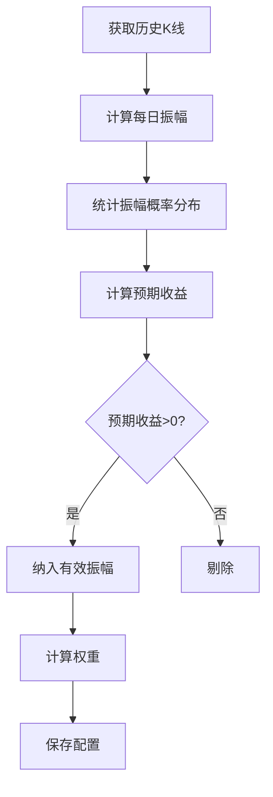
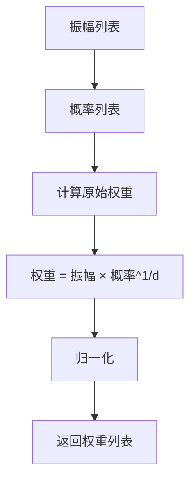
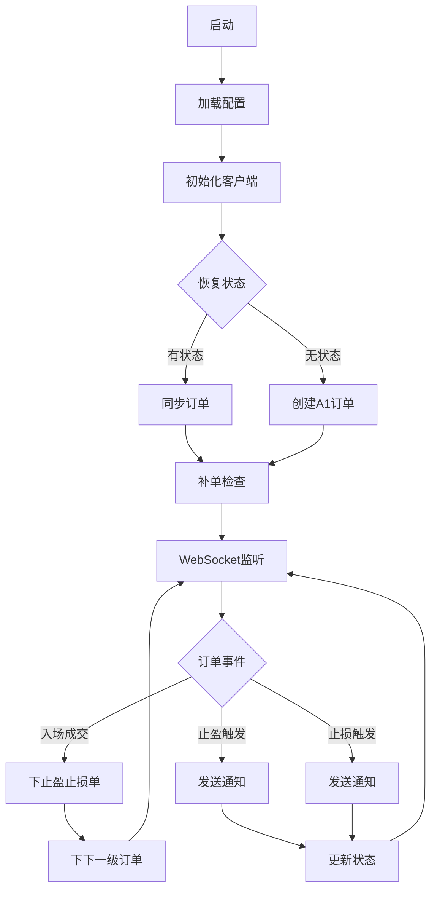
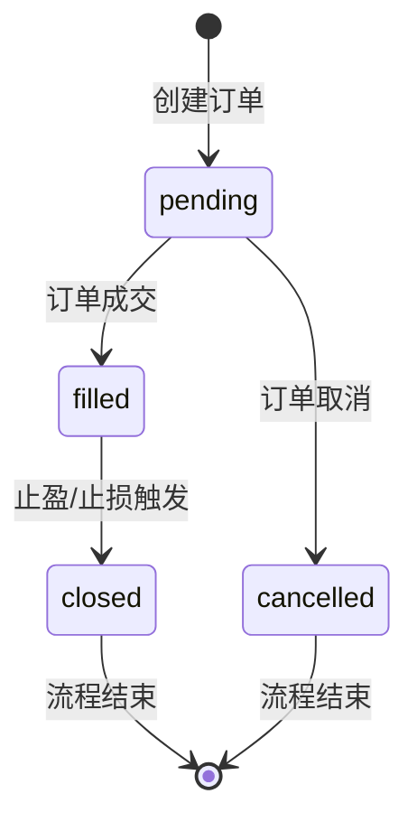
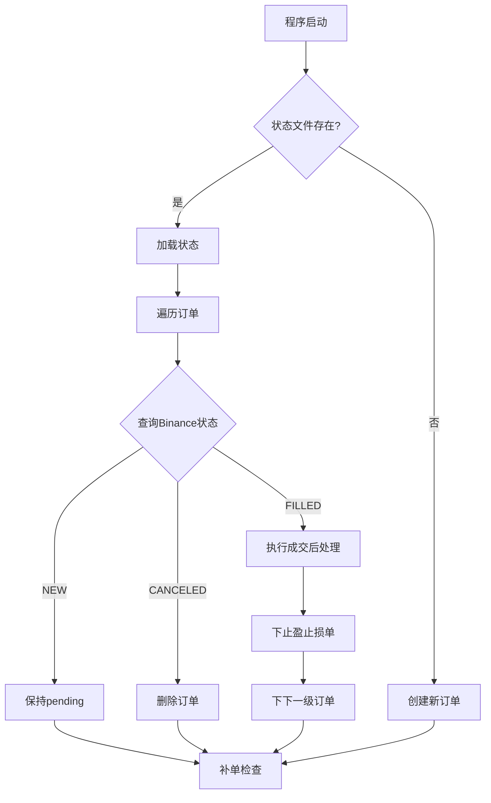
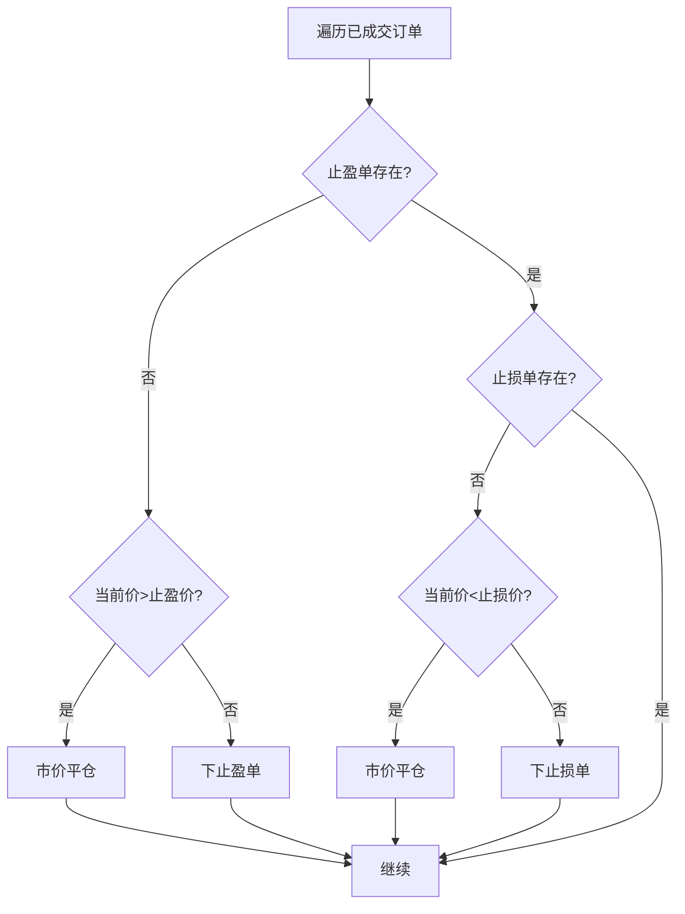
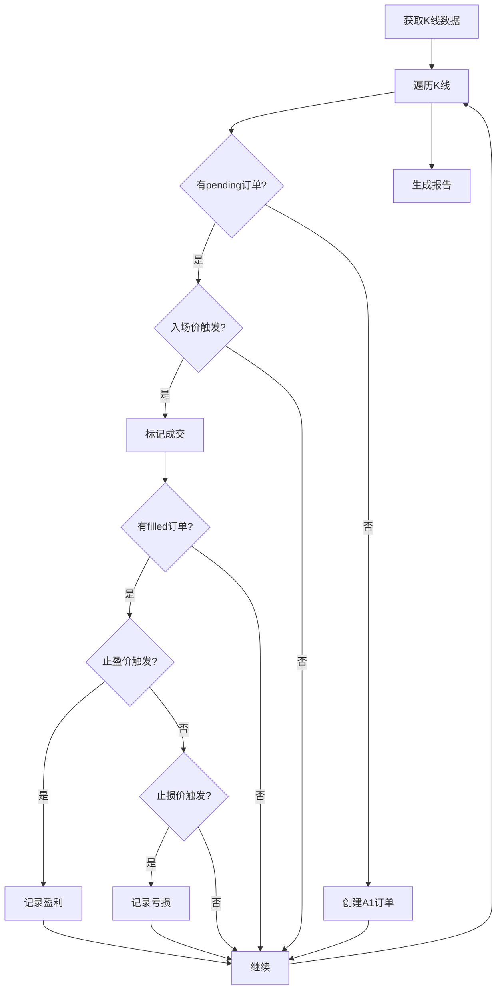
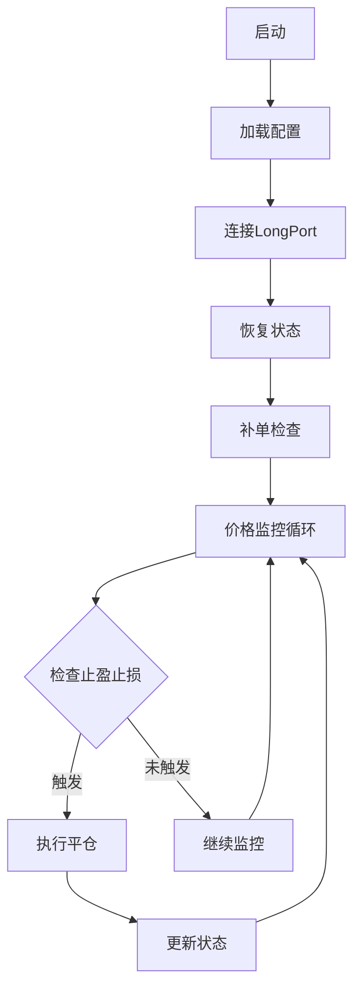

# 代码文件设计文档计划

## 概述

创建 `docs` 目录，为每个代码文件创建对应的设计文档说明，并增加 Autofish 策略算法文档。

## 文档结构

```
autofish_bot_v2/
├── docs/
│   ├── README.md                    # 文档索引
│   ├── autofish_strategy.md         # Autofish 策略算法说明
│   ├── autofish_core_design.md      # autofish_core.py 设计文档
│   ├── binance_live_design.md       # binance_live.py 设计文档
│   ├── binance_backtest_design.md   # binance_backtest.py 设计文档
│   ├── longport_live_design.md      # longport_live.py 设计文档
│   └── longport_backtest_design.md  # longport_backtest.py 设计文档
```

## 文档内容

### 1. docs/README.md - 文档索引

文档目录索引，包含所有文档的链接和简介。

### 2. docs/strategy.md - Autofish 策略算法说明

**结合现有策略文档内容**

#### 2.1 策略概述
- 策略来源：午夜电鱼哥
- 灵感来源：@午饭投资 @午夜投资
- 核心特点：概率权重分配、衰减因子动态调整、震荡套利

#### 2.2 核心公式

**预期收益公式**
```
预期收益 = 概率 × 赔率
```

**权重计算公式**
```
权重 ∝ 振幅 × 概率^(1/d)

其中：
- 振幅: 价格波动幅度（1%, 2%, 3%, ...）
- 概率: 该振幅出现的概率
- d: 衰减因子（0.5 激进 / 1.0 保守）
```

**调整后预期收益**
```
调整后预期收益 = 衰减因子 × 预期收益 × 概率
             = d × (振幅 × 杠杆) × 概率²
```

#### 2.3 算法分析

**概率数据（近一年回测）**
| 振幅 | 1% | 2% | 3% | 4% | 5% | 6% | 7% | 8% | 9% | ≥10% |
|------|-----|-----|-----|-----|-----|-----|-----|-----|-----|------|
| 概率 | 36% | 24% | 16% | 9% | 4% | 3% | 1% | 1% | 1% | 4% |

**权重计算示例（d=0.5）**
```
W_1% = 1 × 0.36^2 = 0.1296
W_2% = 2 × 0.24^2 = 0.1152
...
归一化后得到最终权重
```

#### 2.4 操作规则

**正常行情（d=0.5）**
- 挂单振幅：1%-4%
- 权重分配：36%、32%、21%、9%
- 每下跌1%建仓1份，每上涨1%减仓1份

**波动变大（d=1.0）**
- 权重分配更平均
- 扩大各振幅收益覆盖

#### 2.5 风险分析

**理论模型风险**
- 假设价格震荡，无法识别趋势
- 概率分布基于历史数据，未来可能变化

**操作执行风险**
- 无有效止损机制
- 极端行情可能爆仓

**市场环境风险**
- 单边趋势行情持续亏损
- 手续费侵蚀收益

#### 2.6 优化建议
- 增加趋势识别机制
- 设置整体止损
- 动态调整衰减因子

### 3. docs/autofish_core_design.md

**autofish_core.py 设计文档**

#### 3.1 模块概述
- 核心算法模块，包含所有基础类和算法
- 提供权重计算、订单计算、振幅分析等功能

#### 3.2 类设计

**Autofish_Order - 订单数据类**
```
属性:
- level: 层级（1-4）
- entry_price: 入场价
- quantity: 数量
- take_profit_price: 止盈价
- stop_loss_price: 止损价
- state: 状态（pending/filled/closed）
- order_id: 订单ID
- tp_order_id: 止盈单ID
- sl_order_id: 止损单ID
```

**Autofish_ChainState - 链式状态管理**
```
属性:
- base_price: 基准价格
- orders: 订单列表

方法:
- to_dict(): 序列化为字典
- from_dict(): 从字典反序列化
```

**Autofish_WeightCalculator - 权重计算器**
```
方法:
- calculate_weights(): 计算权重
- get_stake_amount(): 获取金额分配
- get_weight_percentage(): 获取权重百分比
```

**Autofish_OrderCalculator - 订单计算器**
```
方法:
- calculate_prices(): 计算止盈止损价
- create_order(): 创建订单
- calculate_profit(): 计算盈亏
```

**Autofish_AmplitudeAnalyzer - 振幅分析器**
```
方法:
- analyze(): 执行分析
- calculate_amplitude(): 计算振幅
- calculate_probabilities(): 计算概率
- calculate_expected_returns(): 计算预期收益
- calculate_weights_for_decay(): 计算权重
```

**Autofish_AmplitudeConfig - 配置加载器**
```
方法:
- load(): 加载配置
- load_latest(): 加载最新配置
- get_weights(): 获取权重列表
```

#### 3.3 流程图

**振幅分析流程**


**权重计算流程**


### 4. docs/binance_live_design.md

**binance_live.py 设计文档**

#### 4.1 模块概述
- Binance 实盘交易模块
- REST API + WebSocket 实时监听

#### 4.2 类设计

**BinanceClient - REST API 客户端**
```
方法:
- place_order(): 下单
- place_algo_order(): 下条件单
- get_order_status(): 查询订单
- get_positions(): 查询仓位
- get_open_algo_orders(): 查询条件单
```

**AlgoHandler - 条件单处理器**
```
方法:
- handle_algo_update(): 处理条件单更新
- handle_algo_triggered(): 处理触发事件
```

**BinanceLiveTrader - 实盘交易器**
```
方法:
- run(): 主运行方法
- _restore_orders(): 状态恢复
- _check_and_supplement_orders(): 补单检查
- _place_entry_order(): 下入场单
- _place_exit_orders(): 下止盈止损单
- _process_order_filled(): 处理成交
- _place_next_level_order(): 下下一级订单
- _ws_loop(): WebSocket循环
```

#### 4.3 流程图

**整体交易流程**


**订单状态机**


**状态恢复流程**


**补单检查流程**


#### 4.4 关键算法

**最小金额调整算法**
```
if 订单金额 < 100 USDT:
    调整数量 = ceil(100 / 价格 / step_size) * step_size
```

**异常重试机制**
```
连续错误计数
if 连续错误 >= 5:
    退出程序
else:
    发送通知
    等待10秒重试
```

### 5. docs/binance_backtest_design.md

**binance_backtest.py 设计文档**

#### 5.1 模块概述
- Binance 回测模块
- 使用历史 K 线模拟交易

#### 5.2 类设计

**BacktestEngine - 回测引擎**
```
方法:
- run(): 执行回测
- _process_kline(): 处理K线
- save_report(): 保存报告
```

#### 5.3 流程图

**回测主流程**


### 6. docs/longport_live_design.md

**longport_live.py 设计文档**

#### 6.1 模块概述
- LongPort 实盘交易模块
- 支持港股/美股/A股

#### 6.2 类设计

**LongPortClient - LongPort 客户端**
```
方法:
- connect(): 连接
- get_current_price(): 获取当前价
- place_order(): 下单
- get_order_status(): 查询订单
```

**LongPortLiveTrader - LongPort 实盘交易器**
```
与Binance版本的主要差异:
- 无服务器端条件单，需客户端监控价格
- 股票交易有最小交易单位（港股100股/手）
- 股票交易无杠杆
```

#### 6.3 流程图

**LongPort 交易流程**


### 7. docs/longport_backtest_design.md

**longport_backtest.py 设计文档**

#### 7.1 模块概述
- LongPort 回测模块
- 支持港股/美股/A股

#### 7.2 类设计

**LongPortBacktestEngine - LongPort 回测引擎**
```
与Binance版本的主要差异:
- 使用LongPort API获取数据
- 时间戳为毫秒级
- 支持多市场
```

## 实施步骤

### 步骤 1: 创建 docs 目录
```bash
mkdir -p docs
```

### 步骤 2: 创建文档文件
1. 创建 docs/README.md
2. 创建 docs/strategy.md
3. 创建 docs/autofish_core_design.md
4. 创建 docs/binance_live_design.md
5. 创建 docs/binance_backtest_design.md
6. 创建 docs/longport_live_design.md
7. 创建 docs/longport_backtest_design.md

### 步骤 3: 编写文档内容
按照上述内容大纲编写各文档，包含：
- 模块概述
- 类设计说明
- 流程图（Mermaid）
- 关键算法说明

### 步骤 4: 更新主 README.md
在主 README.md 中添加文档链接。

## 预期成果

- 每个代码文件都有对应的设计文档
- 完整的策略算法说明
- 清晰的流程图
- 便于理解代码实现逻辑
- 便于后续维护和扩展
