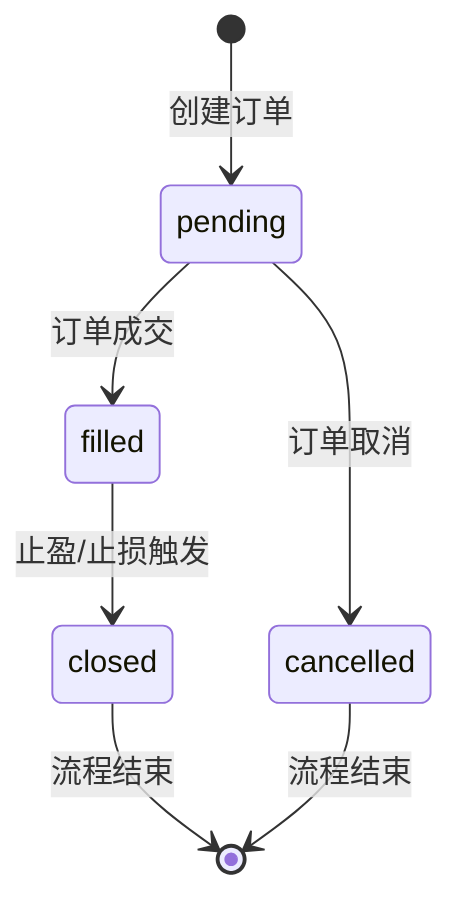
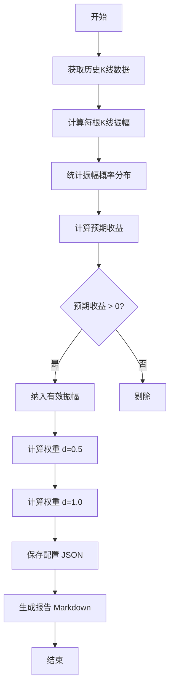
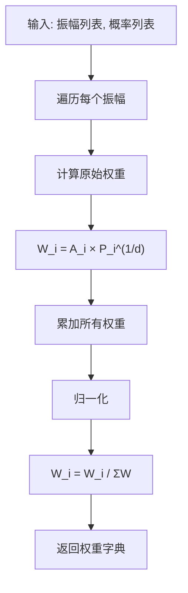
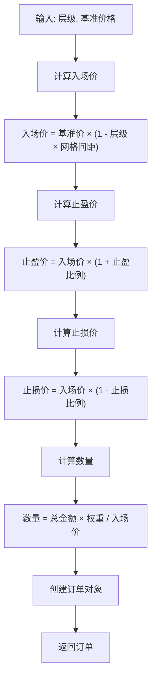
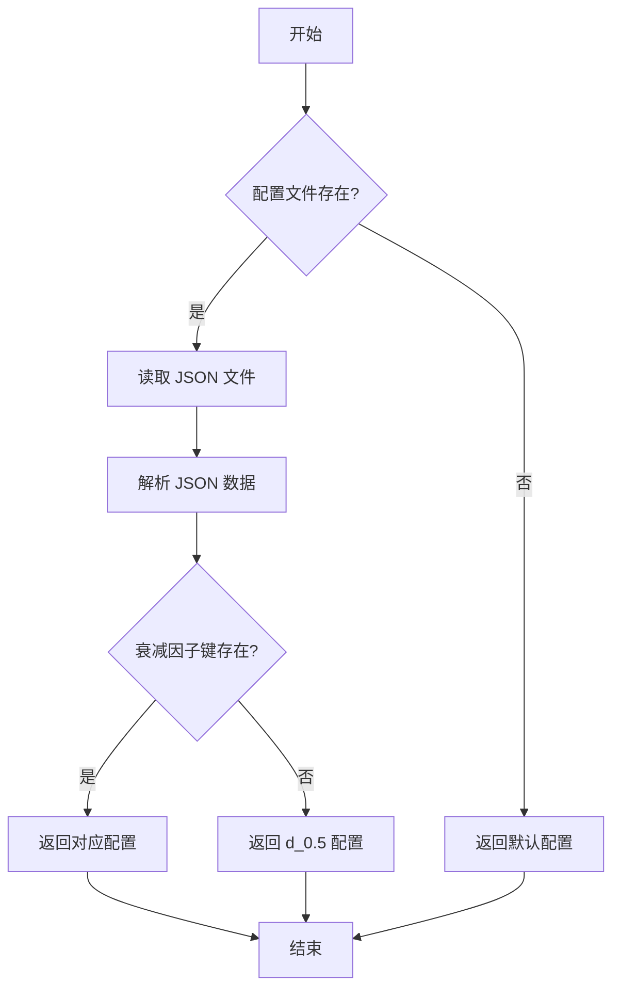

# autofish_core.py 设计文档

## 一、模块概述

`autofish_core.py` 是 Autofish V2 链式挂单策略的核心算法模块，包含所有基础类和算法。

### 1.1 主要功能

- 订单数据结构定义
- 链式状态管理
- 权重计算算法
- 订单价格计算
- 振幅分析
- 配置加载

### 1.2 模块结构

```
autofish_core.py
├── Autofish_Order          # 订单数据类
├── Autofish_ChainState     # 链式状态管理
├── Autofish_WeightCalculator   # 权重计算器
├── Autofish_OrderCalculator    # 订单计算器
├── Autofish_AmplitudeAnalyzer  # 振幅分析器
└── Autofish_AmplitudeConfig    # 配置加载器
```

## 二、类设计

### 2.1 Autofish_Order - 订单数据类

订单数据类，存储单个订单的所有信息。

**属性：**

| 属性 | 类型 | 说明 |
|------|------|------|
| level | int | 层级（1-4） |
| entry_price | Decimal | 入场价格 |
| quantity | Decimal | 数量 |
| stake_amount | Decimal | 金额 |
| take_profit_price | Decimal | 止盈价格 |
| stop_loss_price | Decimal | 止损价格 |
| state | str | 状态（pending/filled/closed） |
| order_id | int | 订单ID |
| tp_order_id | int | 止盈单ID |
| sl_order_id | int | 止损单ID |

**状态流转：**



**方法：**

| 方法 | 说明 |
|------|------|
| to_dict() | 序列化为字典 |
| from_dict() | 从字典反序列化 |

### 2.2 Autofish_ChainState - 链式状态管理

管理所有订单的状态，支持持久化。

**属性：**

| 属性 | 类型 | 说明 |
|------|------|------|
| base_price | Decimal | 基准价格 |
| orders | List[Autofish_Order] | 订单列表 |

**方法：**

| 方法 | 说明 |
|------|------|
| to_dict() | 序列化为字典 |
| from_dict() | 从字典反序列化 |

### 2.3 Autofish_WeightCalculator - 权重计算器

根据振幅概率计算各层级权重。

**属性：**

| 属性 | 类型 | 说明 |
|------|------|------|
| decay_factor | Decimal | 衰减因子（0.5 或 1.0） |

**核心算法：**

```
权重公式: W_i = A_i × P_i^(1/d)

其中：
- W_i: 第 i 层权重
- A_i: 第 i 个振幅区间
- P_i: 第 i 个振幅区间的概率
- d: 衰减因子
```

**方法：**

| 方法 | 参数 | 返回 | 说明 |
|------|------|------|------|
| calculate_weights() | amplitudes, probabilities | Dict[int, Decimal] | 计算权重 |
| get_stake_amount() | level, total_amount | Decimal | 获取金额分配 |
| get_weight_percentage() | level | float | 获取权重百分比 |

**示例：**

```python
calculator = Autofish_WeightCalculator(Decimal("0.5"))
amplitudes = [1, 2, 3, 4]
probabilities = [0.36, 0.24, 0.16, 0.09]
weights = calculator.calculate_weights(amplitudes, probabilities)
# {1: Decimal('0.3693'), 2: Decimal('0.3240'), 3: Decimal('0.2123'), 4: Decimal('0.0949')}
```

### 2.4 Autofish_OrderCalculator - 订单计算器

计算订单价格和创建订单。

**属性：**

| 属性 | 类型 | 说明 |
|------|------|------|
| grid_spacing | Decimal | 网格间距（默认 1%） |
| exit_profit | Decimal | 止盈比例（默认 1%） |
| stop_loss | Decimal | 止损比例（默认 8%） |
| total_amount | Decimal | 总投入金额 |
| leverage | int | 杠杆倍数 |

**价格计算公式：**

```
入场价 = 基准价格 × (1 - 层级 × 网格间距)
止盈价 = 入场价 × (1 + 止盈比例)
止损价 = 入场价 × (1 - 止损比例)
```

**方法：**

| 方法 | 参数 | 返回 | 说明 |
|------|------|------|------|
| calculate_prices() | level, base_price | Tuple[Decimal, Decimal, Decimal] | 计算入场价、止盈价、止损价 |
| create_order() | level, base_price, quantity | Autofish_Order | 创建订单 |
| calculate_profit() | order, exit_price | Decimal | 计算盈亏 |

### 2.5 Autofish_AmplitudeAnalyzer - 振幅分析器

分析历史 K 线数据，计算振幅概率分布和权重。

**属性：**

| 属性 | 类型 | 说明 |
|------|------|------|
| symbol | str | 交易对 |
| interval | str | K线周期 |
| limit | int | K线数量 |
| leverage | int | 杠杆倍数 |
| weights | Dict[str, Dict[int, Decimal]] | 各衰减因子权重 |

**方法：**

| 方法 | 说明 |
|------|------|
| analyze() | 执行完整分析 |
| calculate_amplitude() | 计算单根K线振幅 |
| calculate_probabilities() | 计算振幅概率分布 |
| calculate_expected_returns() | 计算预期收益 |
| calculate_weights_for_decay() | 计算指定衰减因子的权重 |
| save_to_file() | 保存配置到 JSON 文件 |
| save_to_markdown() | 保存报告到 Markdown 文件 |

### 2.6 Autofish_AmplitudeConfig - 配置加载器

加载和管理振幅配置文件。

**属性：**

| 属性 | 类型 | 说明 |
|------|------|------|
| symbol | str | 交易对 |
| source | str | 数据源（binance/longport） |
| decay_factor | Decimal | 衰减因子 |
| data | dict | 配置数据 |

**方法：**

| 方法 | 说明 |
|------|------|
| load() | 加载指定配置文件 |
| load_latest() | 加载最新配置文件 |
| get_weights() | 获取权重列表 |
| get_valid_amplitudes() | 获取有效振幅列表 |
| get_max_entries() | 获取最大层级 |
| get_grid_spacing() | 获取网格间距 |
| get_exit_profit() | 获取止盈比例 |
| get_stop_loss() | 获取止损比例 |

## 三、流程图

### 3.1 振幅分析流程



### 3.2 权重计算流程



### 3.3 订单创建流程



### 3.4 配置加载流程



## 四、关键算法

### 4.1 权重计算算法

```python
def calculate_weights(self, amplitudes: List[int], probabilities: List[float]) -> Dict[int, Decimal]:
    """计算权重
    
    公式: W_i = A_i × P_i^(1/d)
    """
    weights = {}
    total_weight = Decimal("0")
    
    for amp, prob in zip(amplitudes, probabilities):
        # 计算原始权重
        raw_weight = Decimal(str(amp)) * Decimal(str(prob)) ** (1 / self.decay_factor)
        weights[amp] = raw_weight
        total_weight += raw_weight
    
    # 归一化
    for amp in weights:
        weights[amp] = weights[amp] / total_weight
    
    return weights
```

### 4.2 振幅计算算法

```python
def calculate_amplitude(self, kline: Dict) -> float:
    """计算K线振幅
    
    公式: 振幅 = (最高价 - 最低价) / 开盘价 × 100%
    """
    high = float(kline['high'])
    low = float(kline['low'])
    open_price = float(kline['open'])
    
    amplitude = (high - low) / open_price * 100
    return amplitude
```

### 4.3 预期收益计算算法

```python
def calculate_expected_returns(self, amplitudes: List[int], probabilities: List[float]) -> Dict[int, Decimal]:
    """计算预期收益
    
    公式: 预期收益 = 振幅 × 杠杆 × 概率
    """
    expected_returns = {}
    
    for amp, prob in zip(amplitudes, probabilities):
        if amp >= 10:
            # >=10% 振幅触发爆仓
            expected_return = Decimal("-4")
        else:
            expected_return = Decimal(str(amp)) * Decimal(str(self.leverage)) * Decimal(str(prob)) / 100
        expected_returns[amp] = expected_return
    
    return expected_returns
```

## 五、配置文件格式

### 5.1 JSON 配置文件

```json
{
  "d_0.5": {
    "symbol": "BTCUSDT",
    "total_amount_quote": 1200,
    "leverage": 10,
    "decay_factor": 0.5,
    "max_entries": 4,
    "valid_amplitudes": [1, 2, 3, 4, 5, 6, 7, 8, 9],
    "weights": [0.0852, 0.2956, 0.3177, 0.137, 0.1008, 0.0282, 0.0271, 0.0066, 0.0019],
    "grid_spacing": 0.01,
    "exit_profit": 0.01,
    "stop_loss": 0.08,
    "total_expected_return": 0.2942
  },
  "d_1.0": {
    "symbol": "BTCUSDT",
    "total_amount_quote": 1200,
    "leverage": 10,
    "decay_factor": 1.0,
    "max_entries": 4,
    "valid_amplitudes": [1, 2, 3, 4, 5, 6, 7, 8, 9],
    "weights": [0.0622, 0.1638, 0.208, 0.1577, 0.1513, 0.0877, 0.0928, 0.0489, 0.0275],
    "grid_spacing": 0.01,
    "exit_profit": 0.01,
    "stop_loss": 0.08,
    "total_expected_return": 0.2942
  }
}
```

### 5.2 字段说明

| 字段 | 类型 | 说明 |
|------|------|------|
| symbol | str | 交易对 |
| total_amount_quote | Decimal | 总投入金额 |
| leverage | int | 杠杆倍数 |
| decay_factor | Decimal | 衰减因子 |
| max_entries | int | 最大层级 |
| valid_amplitudes | List[int] | 有效振幅区间 |
| weights | List[float] | 各层级权重 |
| grid_spacing | Decimal | 网格间距 |
| exit_profit | Decimal | 止盈比例 |
| stop_loss | Decimal | 止损比例 |
| total_expected_return | Decimal | 总预期收益 |

## 六、使用示例

### 6.1 振幅分析

```python
# 创建分析器
analyzer = Autofish_AmplitudeAnalyzer(
    symbol="BTCUSDT",
    interval="1d",
    limit=1000,
    leverage=10
)

# 执行分析
await analyzer.analyze()

# 保存配置
analyzer.save_to_file()
analyzer.save_to_markdown()
```

### 6.2 配置加载

```python
# 加载配置
config = Autofish_AmplitudeConfig(symbol="BTCUSDT", source="binance")
config.load()

# 获取权重
weights = config.get_weights()
# [0.0852, 0.2956, 0.3177, 0.137, ...]

# 获取有效振幅
amplitudes = config.get_valid_amplitudes()
# [1, 2, 3, 4, 5, 6, 7, 8, 9]
```

### 6.3 权重计算

```python
# 创建计算器
calculator = Autofish_WeightCalculator(Decimal("0.5"))

# 计算权重
weights = calculator.calculate_weights(
    amplitudes=[1, 2, 3, 4],
    probabilities=[0.36, 0.24, 0.16, 0.09]
)

# 获取金额分配
stake = calculator.get_stake_amount(level=1, total_amount=1200)
```

### 6.4 订单创建

```python
# 创建计算器
order_calc = Autofish_OrderCalculator(
    grid_spacing=Decimal("0.01"),
    exit_profit=Decimal("0.01"),
    stop_loss=Decimal("0.08"),
    total_amount=1200,
    leverage=10
)

# 创建订单
order = order_calc.create_order(
    level=1,
    base_price=Decimal("50000"),
    quantity=Decimal("0.001")
)
```

## 七、相关文档

- [autofish_strategy.md](./autofish_strategy.md) - 策略算法说明
- [binance_live_design.md](./binance_live_design.md) - Binance 实盘设计
- [binance_backtest_design.md](./binance_backtest_design.md) - Binance 回测设计
