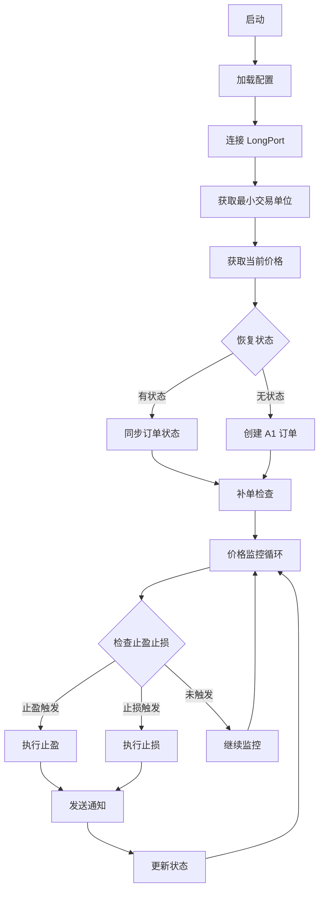
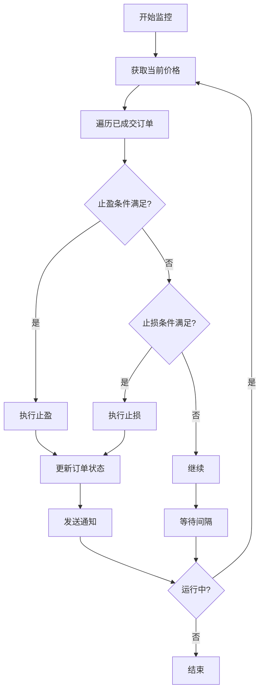
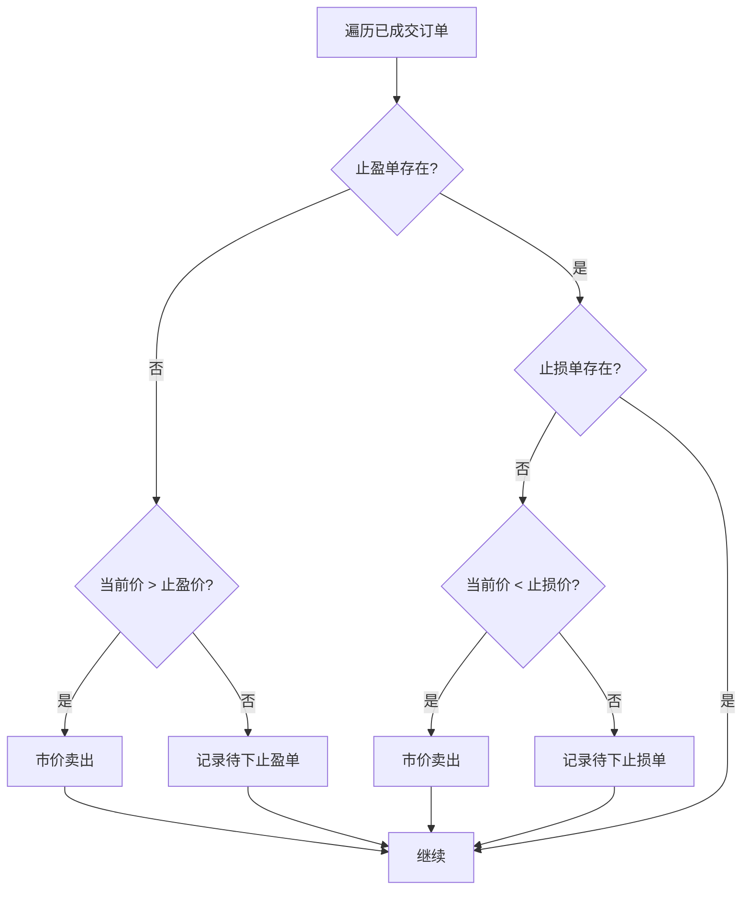

# longport_live.py 设计文档

## 一、模块概述

`longport_live.py` 是 LongPort 实盘交易模块，支持港股、美股、A股的链式挂单策略。

### 1.1 主要功能

- LongPort SDK 封装
- 实时行情获取
- 订单管理（下单、撤单、查询）
- 价格监控（客户端条件单）
- 状态恢复和同步

### 1.2 与 Binance 版本的主要差异

| 特性 | Binance | LongPort |
|------|---------|----------|
| 条件单 | 服务器端执行 | 客户端监控触发 |
| 杠杆 | 支持（最高125倍） | 不支持 |
| 最小交易单位 | 灵活（0.001 BTC） | 固定（港股100股/手） |
| 交易时间 | 7×24小时 | 交易时段限制 |
| 市场范围 | 加密货币 | 港股/美股/A股 |

## 二、类设计

### 2.1 LongPortClient - LongPort 客户端

封装 LongPort OpenAPI SDK。

**属性：**

| 属性 | 类型 | 说明 |
|------|------|------|
| app_key | str | App Key |
| app_secret | str | App Secret |
| access_token | str | Access Token |
| quote_ctx | QuoteContext | 行情上下文 |
| trade_ctx | TradeContext | 交易上下文 |

**方法：**

| 方法 | 说明 |
|------|------|
| connect() | 连接 LongPort |
| get_current_price() | 获取当前价格 |
| get_historical_candles() | 获取历史 K 线 |
| place_order() | 下单 |
| cancel_order() | 撤单 |
| get_order_status() | 查询订单状态 |
| get_positions() | 查询仓位 |
| get_today_orders() | 查询今日订单 |

### 2.2 LongPortLiveTrader - LongPort 实盘交易器

LongPort 实盘交易主逻辑类。

**属性：**

| 属性 | 类型 | 说明 |
|------|------|------|
| config | Dict | 配置字典 |
| client | LongPortClient | LongPort 客户端 |
| chain_state | ChainState | 链式状态 |
| state_repository | StateRepository | 状态持久化 |
| running | bool | 运行标志 |
| lot_size | int | 最小交易单位（港股100，美股1） |
| calculator | WeightCalculator | 权重计算器 |

**方法：**

| 方法 | 说明 |
|------|------|
| run() | 主运行方法 |
| _get_lot_size() | 获取最小交易单位 |
| _get_currency() | 获取货币类型 |
| _restore_orders() | 恢复订单状态 |
| _check_and_supplement_orders() | 补单检查 |
| _monitor_prices() | 价格监控循环 |
| _check_exit_conditions() | 检查止盈止损条件 |
| _place_entry_order() | 下入场单 |
| _place_exit_orders() | 下止盈止损单 |
| _handle_exit() | 处理退出 |

## 三、流程图

### 3.1 LongPort 交易流程



### 3.2 价格监控流程



### 3.3 补单检查流程



## 四、关键算法

### 4.1 最小交易单位处理

```python
def _get_lot_size(self, symbol: str) -> int:
    """获取最小交易单位
    
    港股: 100股/手
    美股: 1股
    A股: 100股/手
    """
    if ".HK" in symbol.upper():
        return 100
    elif ".US" in symbol.upper():
        return 1
    elif ".SH" in symbol.upper() or ".SZ" in symbol.upper():
        return 100
    return 1

def _adjust_quantity(self, quantity: int, lot_size: int) -> int:
    """调整数量为最小交易单位的整数倍"""
    return (quantity // lot_size) * lot_size
```

### 4.2 价格监控算法

```python
async def _monitor_prices(self):
    """价格监控循环"""
    while self.running:
        try:
            current_price = await self.client.get_current_price(self.symbol)
            
            for order in self.chain_state.orders:
                if order.state == "filled":
                    # 检查止盈条件
                    if current_price >= order.take_profit_price:
                        await self._execute_take_profit(order, current_price)
                    
                    # 检查止损条件
                    elif current_price <= order.stop_loss_price:
                        await self._execute_stop_loss(order, current_price)
            
            await asyncio.sleep(5)  # 5秒检查一次
            
        except Exception as e:
            logger.error(f"[价格监控] 异常: {e}")
            await asyncio.sleep(10)
```

### 4.3 货币类型判断

```python
def _get_currency(self, symbol: str) -> str:
    """根据交易对获取货币类型"""
    if ".HK" in symbol.upper():
        return "HKD"
    elif ".US" in symbol.upper():
        return "USD"
    elif ".SH" in symbol.upper() or ".SZ" in symbol.upper():
        return "CNY"
    return "USD"
```

## 五、与 Binance 版本的差异

### 5.1 条件单处理

| 特性 | Binance | LongPort |
|------|---------|----------|
| 条件单类型 | 服务器端 Algo 订单 | 客户端价格监控 |
| 触发延迟 | 毫秒级 | 秒级（5秒轮询） |
| 可靠性 | 高（服务器保证） | 中（依赖客户端） |
| 断线影响 | 无影响 | 可能错过触发 |

### 5.2 交易限制

| 限制 | Binance | LongPort |
|------|---------|----------|
| 交易时间 | 7×24 | 交易时段 |
| 最小金额 | 100 USDT | 无限制 |
| 最小数量 | 0.001 BTC | 100股（港股） |
| 杠杆 | 最高125倍 | 不支持 |

### 5.3 代码差异

```python
# Binance: 服务器端条件单
await self.client.place_algo_order(
    symbol=symbol,
    side="SELL",
    quantity=quantity,
    price=take_profit_price,
    algo_type="TAKE_PROFIT"
)

# LongPort: 客户端监控
# 不下条件单，而是在价格监控循环中检查
async def _monitor_prices(self):
    while self.running:
        current_price = await self.client.get_current_price(symbol)
        if current_price >= take_profit_price:
            await self.client.place_order(side="SELL", quantity=quantity)
```

## 六、配置参数

### 6.1 环境变量

| 变量 | 说明 |
|------|------|
| LONGPORT_APP_KEY | App Key |
| LONGPORT_APP_SECRET | App Secret |
| LONGPORT_ACCESS_TOKEN | Access Token |
| LONGPORT_HTTP_PROXY | HTTP 代理（可选） |
| WECHAT_WEBHOOK | 微信机器人 Webhook |

### 6.2 命令行参数

| 参数 | 默认值 | 说明 |
|------|--------|------|
| --symbol | 700.HK | 交易对 |
| --decay-factor | 0.5 | 衰减因子 |
| --stop-loss | 0.08 | 止损比例 |
| --total-amount | 1200 | 总投入金额 |

## 七、使用示例

### 7.1 启动实盘交易

```bash
# 港股
python longport_live.py --symbol 700.HK --decay-factor 0.5

# 美股
python longport_live.py --symbol AAPL.US --decay-factor 1.0

# A股
python longport_live.py --symbol 600519.SH --decay-factor 0.5
```

### 7.2 交易对格式

| 市场 | 格式 | 示例 |
|------|------|------|
| 港股 | {code}.HK | 700.HK, 9988.HK |
| 美股 | {symbol}.US | AAPL.US, TSLA.US |
| A股 | {code}.SH/.SZ | 600519.SH, 000001.SZ |

## 八、注意事项

### 8.1 交易时间

LongPort 仅在交易时段可下单：

| 市场 | 交易时间（北京时间） |
|------|----------------------|
| 港股 | 09:30-12:00, 13:00-16:00 |
| 美股 | 21:30-04:00（夏令时 21:30-04:00） |
| A股 | 09:30-11:30, 13:00-15:00 |

### 8.2 价格监控延迟

由于 LongPort 不支持服务器端条件单，价格监控存在延迟：

- 轮询间隔：5秒
- 触发延迟：最多5秒
- 断线风险：客户端断线可能错过触发

### 8.3 最小交易单位

港股和 A 股有最小交易单位限制：

- 港股：100股/手
- A股：100股/手
- 美股：1股

数量必须是最小交易单位的整数倍。

## 九、相关文档

- [autofish_strategy.md](./autofish_strategy.md) - 策略算法说明
- [autofish_core_design.md](./autofish_core_design.md) - 核心模块设计
- [binance_live_design.md](./binance_live_design.md) - Binance 实盘设计
