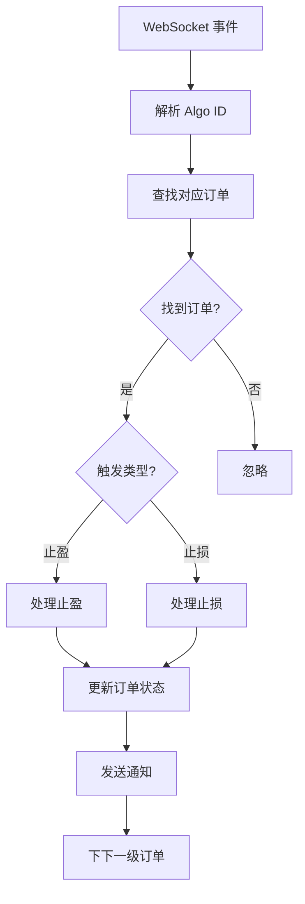
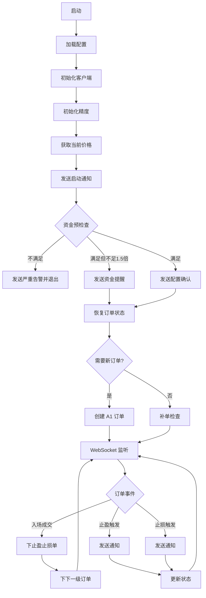
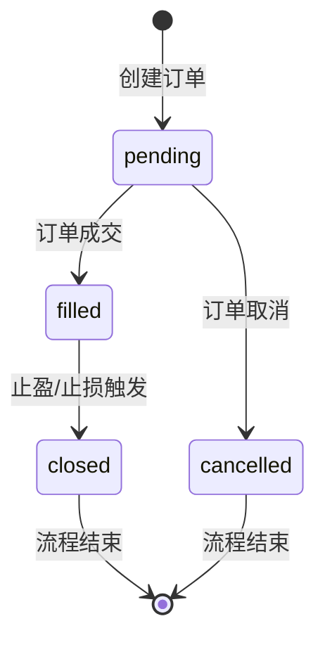
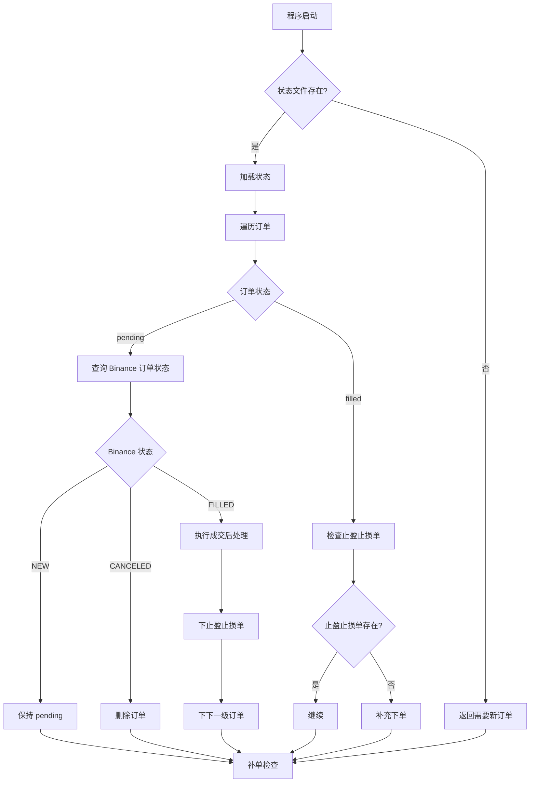
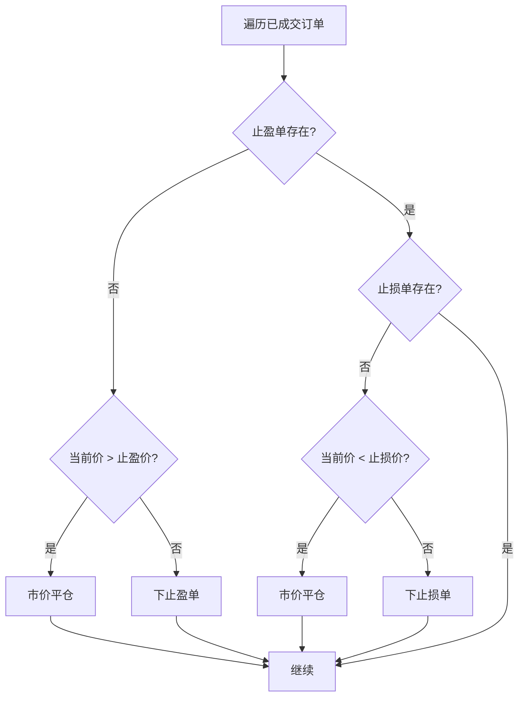
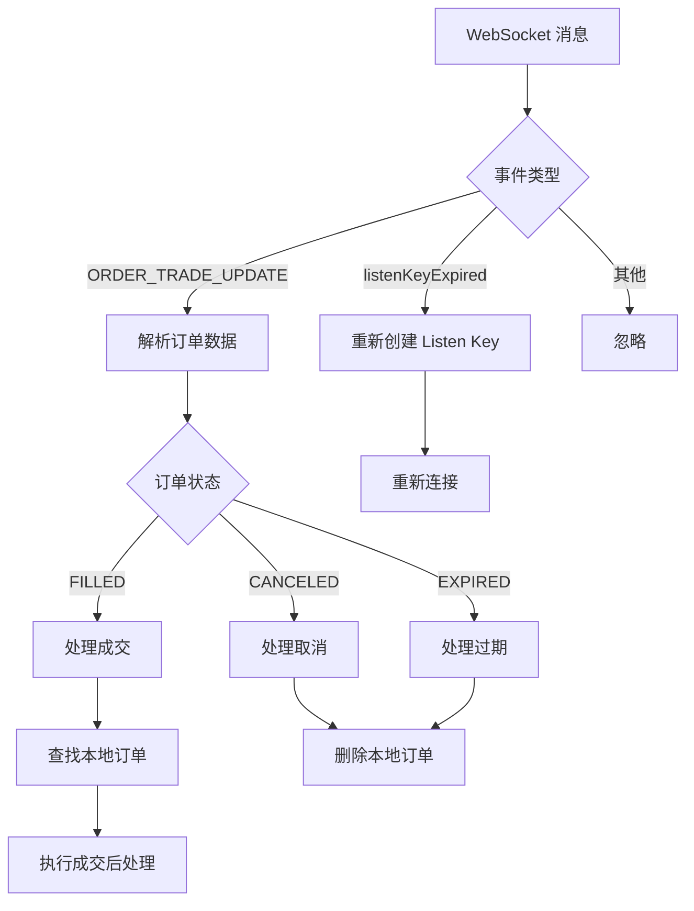
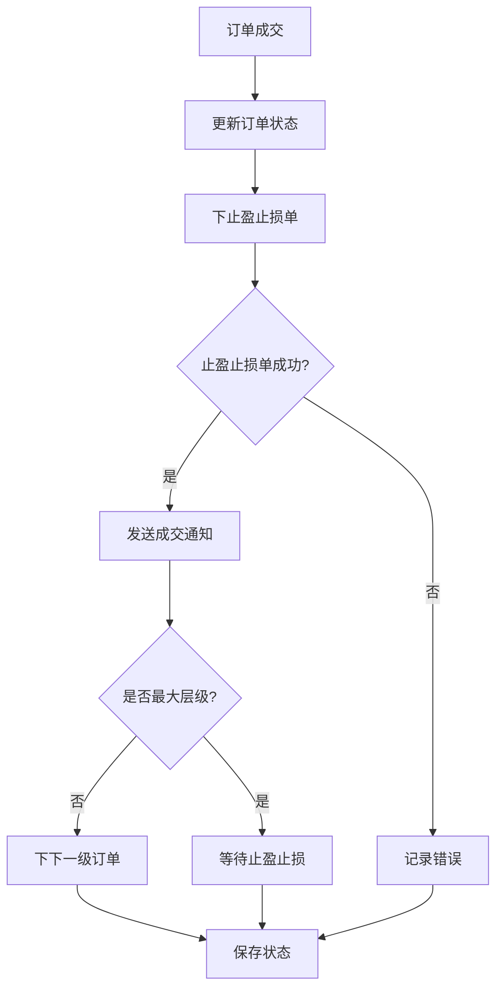

# binance_live.py 设计文档

## 一、模块概述

`binance_live.py` 是 Binance 实盘交易模块，实现链式挂单策略的实盘交易。

### 1.1 主要功能

- REST API 客户端封装
- WebSocket 实时监听
- 订单管理（下单、撤单、查询）
- 条件单管理（止盈止损）
- 状态恢复和同步
- 补单机制
- 异常处理和通知

### 1.2 模块结构

```
binance_live.py
├── BinanceClient           # REST API 客户端
├── AlgoHandler             # 条件单处理器
├── BinanceLiveTrader       # 实盘交易器
├── 通知函数
│   ├── notify_entry_order()
│   ├── notify_entry_filled()
│   ├── notify_take_profit()
│   ├── notify_stop_loss()
│   └── notify_critical_error()
└── 主函数 main()
```

## 二、类设计

### 2.1 BinanceClient - REST API 客户端

封装 Binance Futures REST API。

**属性：**

| 属性 | 类型 | 说明 |
|------|------|------|
| api_key | str | API Key |
| api_secret | str | API Secret |
| testnet | bool | 是否测试网 |
| base_url | str | REST API 基础 URL |
| ws_url | str | WebSocket URL |
| session | aiohttp.ClientSession | HTTP 会话 |
| rate_limiter | asyncio.Semaphore | 请求限流器 |

**方法：**

| 方法 | 说明 |
|------|------|
| _sign_request() | 签名请求 |
| _request() | 发送请求 |
| place_order() | 下单 |
| place_algo_order() | 下条件单 |
| cancel_order() | 撤单 |
| cancel_algo_order() | 撤条件单 |
| get_order_status() | 查询订单状态 |
| get_positions() | 查询仓位 |
| get_open_algo_orders() | 查询条件单 |
| get_current_price() | 获取当前价格 |
| get_exchange_info() | 获取交易规则 |
| create_listen_key() | 创建 Listen Key |
| keepalive_listen_key() | 保活 Listen Key |

**API 接口列表：**

| 接口 | 方法 | 路径 |
|------|------|------|
| 下单 | POST | /fapi/v1/order |
| 条件单 | POST | /fapi/v1/order/algo |
| 撤单 | DELETE | /fapi/v1/order |
| 撤条件单 | DELETE | /fapi/v1/order/algo |
| 查询订单 | GET | /fapi/v1/order |
| 查询仓位 | GET | /fapi/v2/positionRisk |
| 查询条件单 | GET | /fapi/v1/openOrder/algo |
| 当前价格 | GET | /fapi/v1/ticker/price |
| 交易规则 | GET | /fapi/v1/exchangeInfo |
| Listen Key | POST | /fapi/v1/listenKey |

### 2.2 AlgoHandler - 条件单处理器

处理 Binance Algo 条件单（止盈止损单）的状态变化事件。

**属性：**

| 属性 | 类型 | 说明 |
|------|------|------|
| trader | BinanceLiveTrader | 交易器实例 |

**方法：**

| 方法 | 说明 |
|------|------|
| handle_algo_update() | 处理条件单更新 |
| handle_algo_triggered() | 处理触发事件 |

**处理流程：**



### 2.3 BinanceLiveTrader - 实盘交易器

实盘交易主逻辑类。

**属性：**

| 属性 | 类型 | 说明 |
|------|------|------|
| config | Dict | 配置字典 |
| testnet | bool | 是否测试网 |
| chain_state | ChainState | 链式状态 |
| state_repository | StateRepository | 状态持久化 |
| running | bool | 运行标志 |
| client | BinanceClient | API 客户端 |
| algo_handler | AlgoHandler | 条件单处理器 |
| calculator | WeightCalculator | 权重计算器 |
| price_precision | int | 价格精度 |
| qty_precision | int | 数量精度 |
| step_size | Decimal | 数量步长 |
| consecutive_errors | int | 连续错误计数 |

**方法：**

| 方法 | 说明 |
|------|------|
| run() | 主运行方法 |
| _init_precision() | 初始化精度（含 min_notional） |
| _adjust_price() | 调整价格精度 |
| _adjust_quantity() | 调整数量精度 |
| _ceil_amount() | 金额向上取整 |
| _print_level_check_results() | 打印层级检查结果 |
| _check_min_notional() | 检查最小金额要求 |
| _check_fund_sufficiency() | 检查资金是否充足 |
| _restore_orders() | 恢复订单状态 |
| _check_and_supplement_orders() | 补单检查（止盈止损） |
| _handle_entry_supplement() | 处理入场单补充 |
| _create_order() | 创建订单对象 |
| _place_entry_order() | 下入场单 |
| _place_exit_orders() | 下止盈止损单 |
| _place_tp_order() | 下止盈单 |
| _place_sl_order() | 下止损单 |
| _process_order_filled() | 处理成交 |
| _ws_loop() | WebSocket 循环 |
| _handle_ws_message() | 处理消息 |
| _handle_order_update() | 处理订单更新 |
| _handle_exit() | 处理退出 |

## 三、流程图

### 3.1 整体交易流程



### 3.2 订单状态机



### 3.3 状态恢复流程



### 3.4 补单检查流程



### 3.5 WebSocket 消息处理流程



### 3.6 订单成交后处理流程



## 四、关键算法

### 4.1 最小金额调整算法

Binance 要求订单名义价值不小于 min_notional（通常为 100 USDT），该值从 API 获取。

```python
def _adjust_quantity(self, quantity: Decimal, price: Decimal = None) -> Decimal:
    """调整数量精度，并确保满足最小金额要求"""
    min_notional = getattr(self, 'min_notional', Decimal("100"))
    
    # 调整精度
    adjusted = (quantity // self.step_size) * self.step_size
    if adjusted <= 0:
        adjusted = self.step_size
    
    # 检查最小金额
    if price and price > 0:
        current_notional = adjusted * price
        if current_notional < min_notional:
            # 调整数量以满足最小金额要求
            min_quantity = (min_notional / price // self.step_size + 1) * self.step_size
            adjusted = min_quantity
    
    return adjusted
```

### 4.2 资金预检查算法

```python
async def _check_fund_sufficiency(self) -> bool:
    """检查资金是否充足
    
    返回:
        True: 资金满足要求，继续运行
        False: 资金不满足要求，需要退出
    """
    satisfied, check_result = self._check_min_notional()
    
    if not satisfied:
        # 严重告警：资金不满足最小要求，退出程序
        notify_critical_error(...)
        return False
    
    # 检查资金是否充足（建议为最小资金的1.5倍）
    suggested_amount_1_5x = check_result['suggested_min_amount'] * 1.5
    
    if check_result['total_amount'] < suggested_amount_1_5x:
        # 警告：资金储备可能不足
        notify_warning(...)
    else:
        # 确认：资金充足
        send_wechat_notification("✅ Autofish V2 配置确认", ...)
    
    return True
```

### 4.3 异常重试机制

```python
# 连续错误计数
self.consecutive_errors = 0
self.max_consecutive_errors = 5

# 异常处理
except Exception as e:
    self.consecutive_errors += 1
    
    if self.consecutive_errors >= self.max_consecutive_errors:
        # 连续错误 5 次，退出
        await self._handle_exit(f"连续错误 {self.consecutive_errors} 次: {e}")
    else:
        # 发送通知，等待重试
        notify_critical_error(str(e), self.config)
        await asyncio.sleep(10)
```

### 4.3 状态恢复算法

```python
async def _restore_orders(self, current_price: Decimal) -> bool:
    """恢复订单状态"""
    orders_need_process = []
    
    for order in self.chain_state.orders:
        if order.state == "pending" and order.order_id:
            # 查询 Binance 订单状态
            binance_order = await self.client.get_order_status(symbol, order.order_id)
            binance_status = binance_order.get("status")
            
            if binance_status == "FILLED":
                # 记录需要处理的订单
                filled_price = Decimal(str(binance_order.get("avgPrice", order.entry_price)))
                orders_need_process.append((order, filled_price))
    
    # 处理需要处理的订单
    for order, filled_price in orders_need_process:
        await self._process_order_filled(order, filled_price, is_recovery=True)
    
    return len(self.chain_state.orders) == 0
```

## 五、通知机制

### 5.1 通知类型

| 通知类型 | 函数 | 触发时机 |
|----------|------|----------|
| 启动 | notify_startup() | 程序启动 |
| 入场单 | notify_entry_order() | 下入场单成功 |
| 成交 | notify_entry_filled() | 入场单成交 |
| 止盈 | notify_take_profit() | 止盈单触发 |
| 止损 | notify_stop_loss() | 止损单触发 |
| 严重错误 | notify_critical_error() | 资金不足或发生异常 |
| 资金提醒 | notify_warning() | 资金储备不足 |
| 配置确认 | send_wechat_notification() | 资金配置检查通过 |

### 5.2 通知渠道

- 微信机器人（企业微信 Webhook）
- Server酱（可选）

### 5.3 通知内容示例

**入场单通知：**
```
> **订单类型**: 入场单
> **交易标的**: BTCUSDT
> **层级**: A1 / 4
> **入场价**: 67000.00
> **数量**: 0.001 BTC
> **金额**: 67.00 USDT
> **止盈价**: 67670.00
> **止损价**: 61640.00
> **时间**: 2026-03-08 12:00:00
```

**成交通知：**
```
> **订单类型**: 入场成交
> **交易标的**: BTCUSDT
> **层级**: A1 / 4
> **成交价**: 67000.00
> **数量**: 0.001 BTC
> **金额**: 67.00 USDT
> **止盈价**: 67670.00
> **止损价**: 61640.00
> **时间**: 2026-03-08 12:05:00
```

## 六、配置参数

### 6.1 环境变量

| 变量 | 说明 |
|------|------|
| BINANCE_TESTNET_API_KEY | 测试网 API Key |
| BINANCE_TESTNET_SECRET_KEY | 测试网 API Secret |
| BINANCE_API_KEY | 主网 API Key |
| BINANCE_SECRET_KEY | 主网 API Secret |
| WECHAT_WEBHOOK | 微信机器人 Webhook |
| HTTP_PROXY | HTTP 代理 |
| HTTPS_PROXY | HTTPS 代理 |

### 6.2 命令行参数

| 参数 | 默认值 | 说明 |
|------|--------|------|
| --symbol | BTCUSDT | 交易对 |
| --testnet | - | 使用测试网 |
| --no-testnet | - | 使用主网 |
| --decay-factor | 0.5 | 衰减因子 |

**说明**：
- `stop_loss`、`total_amount_quote`、`entry_price_strategy` 从配置文件读取
- 配置文件由振幅分析生成，或使用内置默认配置

## 七、使用示例

### 7.1 启动实盘交易

```bash
# 测试网
python binance_live.py --symbol BTCUSDT --testnet --decay-factor 0.5

# 主网
python binance_live.py --symbol BTCUSDT --no-testnet --decay-factor 1.0
```

### 7.2 使用脚本管理

```bash
# 启动（默认 BTCUSDT 测试网）
./binance_live_run.sh start

# 启动指定交易对
./binance_live_run.sh --symbol ETHUSDT start

# 启动主网
./binance_live_run.sh --symbol BTCUSDT --no-testnet start

# 启动保守策略
./binance_live_run.sh --symbol ETHUSDT --decay-factor 1.0 start

# 查看状态
./binance_live_run.sh status

# 停止
./binance_live_run.sh stop

# 重启（智能判断：运行中先停止再启动，未运行直接启动）
./binance_live_run.sh restart
```

**脚本参数**：

| 参数 | 默认值 | 说明 |
|------|--------|------|
| --symbol | BTCUSDT | 交易对 |
| --testnet | - | 使用测试网（默认） |
| --no-testnet | - | 使用主网 |
| --decay-factor | 0.5 | 衰减因子 |

**说明**：
- 参数可以放在命令前或命令后，如 `--symbol ETHUSDT start` 或 `start --symbol ETHUSDT`
- 脚本会自动将参数传递给后台进程

## 八、相关文档

- [autofish_strategy.md](./autofish_strategy.md) - 策略算法说明
- [autofish_core_design.md](./autofish_core_design.md) - 核心模块设计
- [binance_backtest_design.md](./binance_backtest_design.md) - Binance 回测设计
