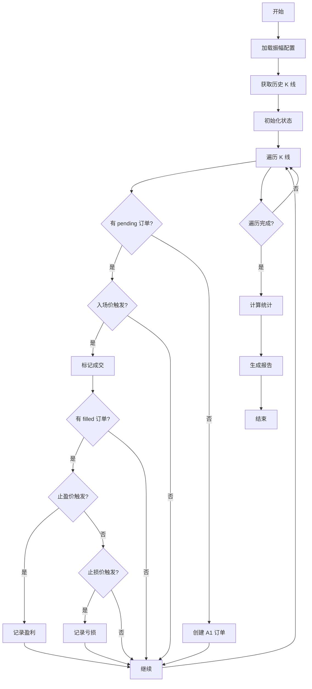
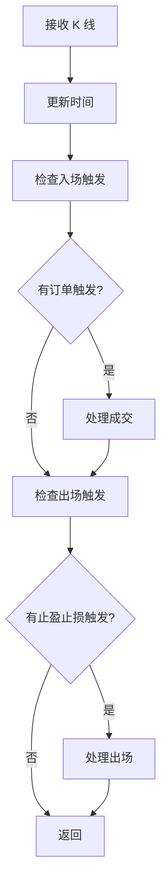
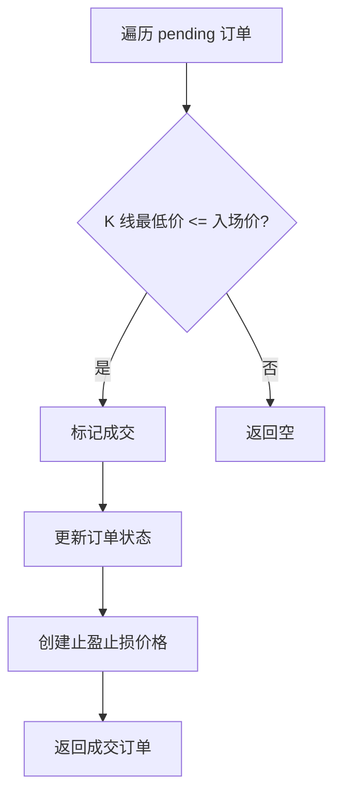
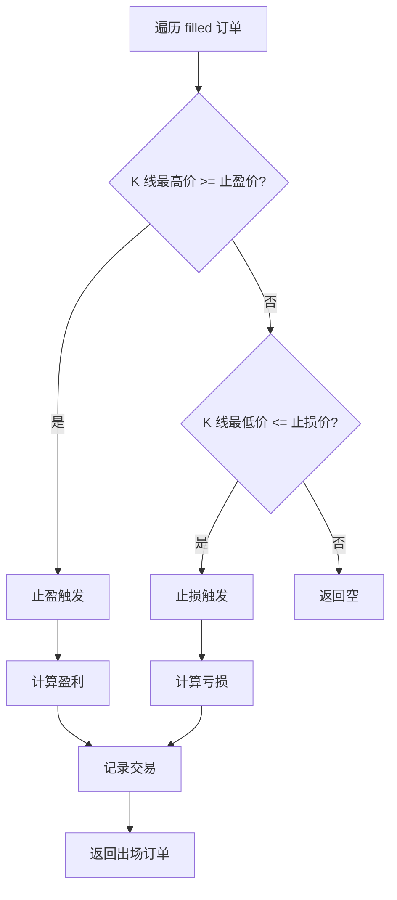

# binance_backtest.py 设计文档

## 一、模块概述

`binance_backtest.py` 是 Binance 回测模块，使用历史 K 线数据模拟链式挂单策略的执行过程。

### 1.1 主要功能

- 获取历史 K 线数据
- 模拟订单执行（入场、止盈、止损）
- 计算盈亏统计
- 生成回测报告

### 1.2 与实盘的区别

| 特性 | 回测 | 实盘 |
|------|------|------|
| 数据来源 | 历史 K 线 | 实时行情 |
| 订单执行 | 模拟 | 真实下单 |
| 条件单 | 检测触发 | 服务器端执行 |
| 状态持久化 | 内存 | 文件 |
| 通知 | 无 | 微信通知 |

## 二、类设计

### 2.1 BacktestEngine - 回测引擎

**属性：**

| 属性 | 类型 | 说明 |
|------|------|------|
| config | Dict | 配置字典 |
| interval | str | K线周期 |
| calculator | WeightCalculator | 权重计算器 |
| chain_state | ChainState | 链式状态 |
| results | Dict | 回测结果统计 |
| kline_count | int | 已处理的 K 线数量 |
| start_time | datetime | 回测开始时间 |
| end_time | datetime | 回测结束时间 |

**方法：**

| 方法 | 说明 |
|------|------|
| run() | 执行回测 |
| _get_weights() | 获取权重 |
| _create_order() | 创建订单 |
| _process_kline() | 处理单根 K 线 |
| _check_entry_triggered() | 检查入场触发 |
| _check_exit_triggered() | 检查出场触发 |
| save_report() | 保存报告 |

## 三、流程图

### 3.1 回测主流程



### 3.2 K 线处理流程



### 3.3 入场检测流程



### 3.4 出场检测流程



## 四、关键算法

### 4.1 入场检测算法

```python
def _check_entry_triggered(self, kline: Dict, order: Order) -> bool:
    """检查入场是否触发
    
    条件: K 线最低价 <= 入场价
    """
    low = Decimal(str(kline['low']))
    return low <= order.entry_price
```

### 4.2 出场检测算法

```python
def _check_exit_triggered(self, kline: Dict, order: Order) -> Tuple[str, Decimal]:
    """检查出场是否触发
    
    返回: (触发类型, 触发价格)
    - ('tp', price): 止盈触发
    - ('sl', price): 止损触发
    - (None, None): 未触发
    """
    high = Decimal(str(kline['high']))
    low = Decimal(str(kline['low']))
    
    # 先检查止盈（优先级更高）
    if high >= order.take_profit_price:
        return ('tp', order.take_profit_price)
    
    # 再检查止损
    if low <= order.stop_loss_price:
        return ('sl', order.stop_loss_price)
    
    return (None, None)
```

### 4.3 盈亏计算算法

```python
def calculate_profit(self, order: Order, exit_price: Decimal, exit_type: str) -> Decimal:
    """计算盈亏
    
    盈亏 = (出场价 - 入场价) × 数量 × 方向
    """
    if exit_type == 'tp':
        # 止盈
        profit = (exit_price - order.entry_price) * order.quantity
    else:
        # 止损
        profit = (exit_price - order.entry_price) * order.quantity
    
    return profit
```

## 五、报告生成

### 5.1 报告格式

```markdown
# Autofish V1 回测报告

## 回测区间

| 项目 | 值 |
|------|-----|
| 交易对 | BTCUSDT |
| K线周期 | 1h |
| 开始时间 | 2026-03-01 00:00 |
| 结束时间 | 2026-03-07 23:00 |
| K线数量 | 168 |

## 振幅配置

| 项目 | 值 |
|------|-----|
| 衰减因子 | 0.5 |
| 总投入金额 | 1200 USDT |
| 杠杆倍数 | 10 |
| 最大层级 | 4 |
| 网格间距 | 1% |
| 止盈比例 | 1% |
| 止损比例 | 8% |

## 权重分配

| 层级 | 振幅 | 权重 |
|------|------|------|
| A1 | 1% | 36.93% |
| A2 | 2% | 32.40% |
| A3 | 3% | 21.23% |
| A4 | 4% | 9.49% |

## 回测结果

| 指标 | 值 |
|------|-----|
| 总交易次数 | 10 |
| 盈利次数 | 7 |
| 亏损次数 | 3 |
| 胜率 | 70.00% |
| 总盈利 | 35.50 USDT |
| 总亏损 | -12.30 USDT |
| 净收益 | 23.20 USDT |
| 收益率 | 1.93% |

## 交易明细

| 序号 | 层级 | 入场时间 | 入场价 | 出场时间 | 出场价 | 出场类型 | 盈亏 |
|------|------|----------|--------|----------|--------|----------|------|
| 1 | A1 | 2026-03-01 10:00 | 67000 | 2026-03-01 12:00 | 67670 | 止盈 | +6.70 |
| 2 | A2 | 2026-03-02 08:00 | 66330 | 2026-03-02 15:00 | 61024 | 止损 | -5.31 |
```

### 5.2 统计指标

| 指标 | 计算公式 |
|------|----------|
| 胜率 | 盈利次数 / 总交易次数 × 100% |
| 收益率 | 净收益 / 总投入金额 × 100% |
| 平均盈利 | 总盈利 / 盈利次数 |
| 平均亏损 | 总亏损 / 亏损次数 |
| 盈亏比 | 平均盈利 / 平均亏损 |

## 六、配置参数

### 6.1 命令行参数

| 参数 | 默认值 | 说明 |
|------|--------|------|
| --symbol | BTCUSDT | 交易对 |
| --interval | 1m | K线周期 |
| --limit | 1500 | K线数量 |
| --decay-factor | 0.5 | 衰减因子 |
| --stop-loss | 0.08 | 止损比例 |
| --total-amount | 20000 | 总投入金额 |

### 6.2 使用示例

```bash
# 基本用法
python binance_backtest.py --symbol BTCUSDT --interval 1m --limit 500

# 使用保守策略
python binance_backtest.py --symbol ETHUSDT --interval 1m --decay-factor 1.0

# 自定义参数
python binance_backtest.py --symbol SOLUSDT --interval 1m --limit 1000 --stop-loss 0.05
```

## 七、输出文件

### 7.1 文件列表

| 文件 | 说明 |
|------|------|
| out/autofish/binance_{symbol}_backtest_report.md | 回测报告 |
| out/autofish/binance_{symbol}_amplitude_config.json | 振幅配置（如果执行了分析） |

### 7.2 文件命名规则

```
binance_{symbol}_backtest_report.md
binance_{symbol}_amplitude_config.json

例如：
binance_BTCUSDT_backtest_report.md
binance_BTCUSDT_amplitude_config.json
```

## 八、回测精度问题与改进

### 8.1 问题分析

#### K 线数据局限性

K 线只提供 OHLC 四个价格点，无法知道：
- 价格在 K 线内的具体走势
- High 和 Low 谁先到达
- 价格在 K 线内的波动次数

#### 同时触及止盈止损问题

当一个 K 线同时触及止盈价和止损价时，回测无法准确判断触发顺序。

**场景示例**：

```
假设一个 1 小时 K 线：
- Open: 67000
- High: 67500（触及止盈 67200）
- Low: 66000（触及止损 66100）
- Close: 66500

问题：无法知道是先涨到 67500 还是先跌到 66000
```

#### 算法特性

Autofish 是**振幅触发算法**，不是周期触发算法：
- 订单触发取决于价格是否触及目标价位
- 与时间周期无关
- 需要精确的价格序列

### 8.2 改进措施

#### 短期改进：K 线内判断逻辑

当 K 线同时触及止盈止损时，根据 K 线形态判断触发顺序：

| K 线形态 | 假设价格走势 | 判断结果 |
|----------|--------------|----------|
| 阳线 (Close > Open) | 先跌后涨 | 止损先触发 |
| 阴线 (Close < Open) | 先涨后跌 | 止盈先触发 |
| 十字星 (Close ≈ Open) | 保守估计 | 止损先触发 |

```python
def _determine_exit_order(self, order, open_price, high_price, low_price, close_price):
    """判断止盈止损触发顺序"""
    if close_price > open_price:
        return "stop_loss"  # 阳线：先跌后涨
    elif close_price < open_price:
        return "take_profit"  # 阴线：先涨后跌
    else:
        return "stop_loss"  # 十字星：保守估计
```

#### 中期改进：置信区间

提供乐观/保守/中性三种估计：

| 估计类型 | 假设 | 说明 |
|----------|------|------|
| 乐观估计 | 止盈先触发 | 最大化收益 |
| 保守估计 | 止损先触发 | 最小化收益 |
| 中性估计 | 根据 K 线形态 | 平衡估计 |

#### 长期改进：Tick 级别回测

使用 Binance aggTrades API 获取逐笔成交数据：

| API 接口 | 说明 | 限制 |
|----------|------|------|
| `/api/v3/trades` | 最近成交 | 最多 1000 条 |
| `/api/v3/historicalTrades` | 历史成交 | 需要 API Key |
| `/api/v3/aggTrades` | 归集成交 | 时间间隔最多 1 小时 |

### 8.3 K 线周期建议

| 周期 | 精度 | 数据量 | 建议场景 |
|------|------|--------|----------|
| 1m | 高 | 大 | 推荐：精确回测 |
| 5m | 中 | 中 | 可接受 |
| 15m | 中低 | 中 | 谨慎使用 |
| 1h | 低 | 小 | 不推荐：偏差较大 |

**建议**：使用 1m K 线进行回测，减小单根 K 线内同时触及止盈止损的概率。

### 8.4 回测报告改进

新增统计指标：

| 指标 | 说明 |
|------|------|
| 同时触及止盈止损次数 | K 线同时触及止盈止损的次数 |
| 同时触及占比 | 同时触及次数 / 总交易次数 |

## 九、相关文档

- [autofish_strategy.md](./autofish_strategy.md) - 策略算法说明
- [autofish_core_design.md](./autofish_core_design.md) - 核心模块设计
- [binance_live_design.md](./binance_live_design.md) - Binance 实盘设计
