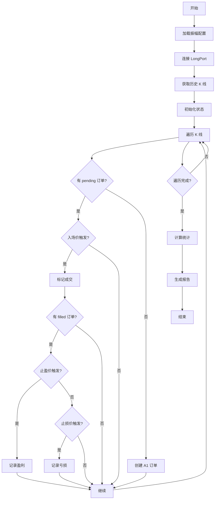
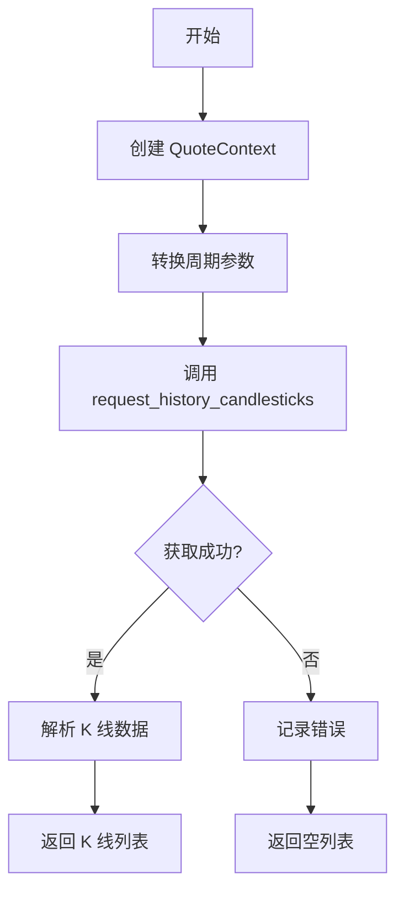
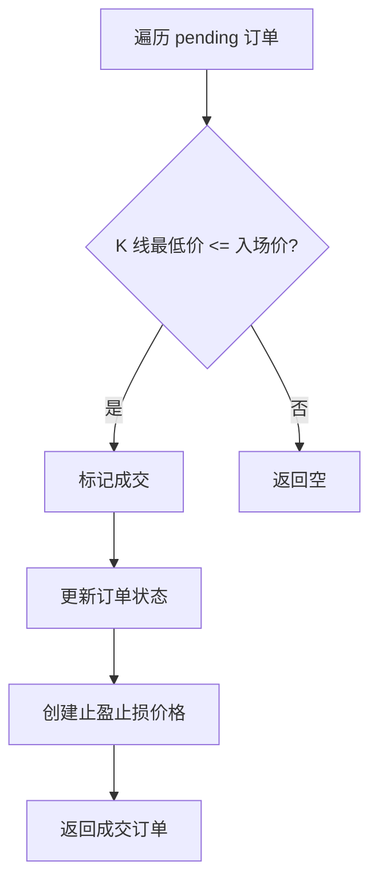
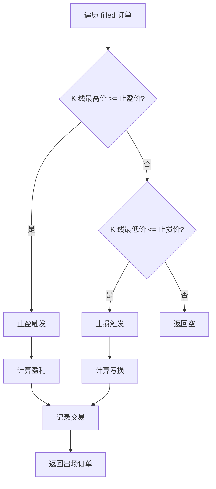

# longport_backtest.py 设计文档

## 一、模块概述

`longport_backtest.py` 是 LongPort 回测模块，使用 LongPort API 获取历史 K 线数据进行策略回测，支持港股、美股、A股。

### 1.1 主要功能

- 获取历史 K 线数据（通过 LongPort API）
- 模拟订单执行（入场、止盈、止损）
- 计算盈亏统计
- 生成回测报告

### 1.2 与 Binance 版本的主要差异

| 特性 | Binance | LongPort |
|------|---------|----------|
| 数据来源 | Binance API | LongPort API |
| 时间戳 | 毫秒级 | 毫秒级 |
| 市场范围 | 加密货币 | 港股/美股/A股 |
| 杠杆 | 支持 | 不支持 |
| 最小交易单位 | 灵活 | 固定（港股100股/手） |

## 二、类设计

### 2.1 LongPortBacktestEngine - LongPort 回测引擎

**属性：**

| 属性 | 类型 | 说明 |
|------|------|------|
| config | Dict | 配置字典 |
| interval | str | K线周期 |
| calculator | WeightCalculator | 权重计算器 |
| chain_state | ChainState | 链式状态 |
| results | Dict | 回测结果统计 |
| kline_count | int | 已处理的 K 线数量 |
| start_time | datetime | 回测开始时间 |
| end_time | datetime | 回测结束时间 |
| quote_ctx | QuoteContext | LongPort 行情上下文 |

**方法：**

| 方法 | 说明 |
|------|------|
| run() | 执行回测 |
| _get_currency() | 获取货币类型 |
| _get_weights() | 获取权重 |
| _create_order() | 创建订单 |
| save_report() | 保存报告 |

### 2.2 辅助函数

**get_period_from_interval() - 周期转换**

将命令行参数的周期字符串转换为 LongPort SDK 的 Period 枚举。

| 参数 | Period 枚举 |
|------|-------------|
| 1m | Period.Min_1 |
| 5m | Period.Min_5 |
| 15m | Period.Min_15 |
| 30m | Period.Min_30 |
| 60m | Period.Min_60 |
| 1d | Period.Day |
| 1w | Period.Week |
| 1M | Period.Month |

## 三、流程图

### 3.1 回测主流程



### 3.2 K 线获取流程



### 3.3 入场检测流程



### 3.4 出场检测流程



## 四、关键算法

### 4.1 K 线数据获取

```python
async def run(self, symbol: str = "700.HK", interval: str = "1d", count: int = 200):
    """运行回测"""
    # 创建行情上下文
    config = Config.from_env()
    self.quote_ctx = QuoteContext(config)
    
    # 获取历史 K 线
    period = get_period_from_interval(interval)
    candles = await self.quote_ctx.request_history_candlesticks(
        symbol=symbol,
        period=period,
        adjust_type=AdjustType.NoAdjust,
        count=count
    )
    
    # 处理 K 线
    for candle in candles:
        kline = {
            'timestamp': candle.timestamp,
            'open': candle.open,
            'high': candle.high,
            'low': candle.low,
            'close': candle.close,
            'volume': candle.volume
        }
        await self._process_kline(kline)
```

### 4.2 货币类型判断

```python
def _get_currency(self) -> str:
    """根据交易对获取货币类型"""
    symbol = self.config.get("symbol", "700.HK")
    if ".HK" in symbol.upper():
        return "HKD"
    elif ".US" in symbol.upper():
        return "USD"
    elif ".SH" in symbol.upper() or ".SZ" in symbol.upper():
        return "CNY"
    return "USD"
```

### 4.3 入场检测算法

```python
def _check_entry_triggered(self, kline: Dict, order: Order) -> bool:
    """检查入场是否触发
    
    条件: K 线最低价 <= 入场价
    """
    low = Decimal(str(kline['low']))
    return low <= order.entry_price
```

### 4.4 出场检测算法

```python
def _check_exit_triggered(self, kline: Dict, order: Order) -> Tuple[str, Decimal]:
    """检查出场是否触发
    
    返回: (触发类型, 触发价格)
    """
    high = Decimal(str(kline['high']))
    low = Decimal(str(kline['low']))
    
    # 先检查止盈（优先级更高）
    if high >= order.take_profit_price:
        return ('tp', order.take_profit_price)
    
    # 再检查止损
    if low <= order.stop_loss_price:
        return ('sl', order.stop_loss_price)
    
    return (None, None)
```

## 五、报告生成

### 5.1 报告格式

```markdown
# Autofish V1 LongPort 回测报告

## 回测区间

| 项目 | 值 |
|------|-----|
| 交易对 | 700.HK |
| K线周期 | 1d |
| 开始时间 | 2025-05-20 |
| 结束时间 | 2026-03-06 |
| K线数量 | 199 |

## 振幅配置

| 项目 | 值 |
|------|-----|
| 衰减因子 | 0.5 |
| 总投入金额 | 1200 HKD |
| 最大层级 | 4 |
| 网格间距 | 1% |
| 止盈比例 | 1% |
| 止损比例 | 8% |

## 回测结果

| 指标 | 值 |
|------|-----|
| 总交易次数 | 3 |
| 盈利次数 | 3 |
| 亏损次数 | 0 |
| 胜率 | 100.00% |
| 总盈利 | 9.71 HKD |
| 总亏损 | 0.00 HKD |
| 净收益 | 9.71 HKD |
| 收益率 | 0.81% |

## 交易明细

| 序号 | 层级 | 入场时间 | 入场价 | 出场时间 | 出场价 | 出场类型 | 盈亏 |
|------|------|----------|--------|----------|--------|----------|------|
| 1 | A1 | 2026-03-04 09:35 | 450.00 | 2026-03-04 14:00 | 454.50 | 止盈 | +4.50 |
```

### 5.2 统计指标

| 指标 | 计算公式 |
|------|----------|
| 胜率 | 盈利次数 / 总交易次数 × 100% |
| 收益率 | 净收益 / 总投入金额 × 100% |
| 平均盈利 | 总盈利 / 盈利次数 |
| 平均亏损 | 总亏损 / 亏损次数 |
| 盈亏比 | 平均盈利 / 平均亏损 |

## 六、配置参数

### 6.1 环境变量

| 变量 | 说明 |
|------|------|
| LONGPORT_APP_KEY | App Key |
| LONGPORT_APP_SECRET | App Secret |
| LONGPORT_ACCESS_TOKEN | Access Token |
| LONGPORT_HTTP_PROXY | HTTP 代理（可选） |

### 6.2 命令行参数

| 参数 | 默认值 | 说明 |
|------|--------|------|
| --symbol | 700.HK | 交易对 |
| --interval | 1d | K线周期 |
| --count | 200 | K线数量 |
| --decay-factor | 0.5 | 衰减因子 |
| --stop-loss | 0.08 | 止损比例 |
| --total-amount | 1200 | 总投入金额 |

### 6.3 使用示例

```bash
# 港股回测
python longport_backtest.py --symbol 700.HK --interval 1d --count 200

# 美股回测
python longport_backtest.py --symbol AAPL.US --interval 1d --count 200

# A股回测
python longport_backtest.py --symbol 600519.SH --interval 1d --count 200

# 使用保守策略
python longport_backtest.py --symbol 700.HK --decay-factor 1.0
```

## 七、与 Binance 版本的差异

### 7.1 数据获取差异

| 特性 | Binance | LongPort |
|------|---------|----------|
| API | Binance REST API | LongPort OpenAPI SDK |
| 时间戳 | 毫秒级 | 毫秒级 |
| K线数量限制 | 1000 | 200 |
| 周期支持 | 1m, 5m, 15m, 1h, 4h, 1d | 1m, 5m, 15m, 30m, 60m, 1d, 1w, 1M |

### 7.2 代码差异

```python
# Binance: 使用 ccxt 或 requests
import ccxt
exchange = ccxt.binance()
klines = exchange.fetch_ohlcv(symbol, timeframe, limit=limit)

# LongPort: 使用 LongPort SDK
from longport.openapi import Config, QuoteContext, Period
config = Config.from_env()
quote_ctx = QuoteContext(config)
candles = await quote_ctx.request_history_candlesticks(
    symbol=symbol,
    period=Period.Day,
    count=count
)
```

### 7.3 时间戳处理

```python
# Binance: 毫秒时间戳
timestamp = kline[0] / 1000

# LongPort: 毫秒时间戳
timestamp = candle.timestamp // 1000
```

## 八、输出文件

### 8.1 文件列表

| 文件 | 说明 |
|------|------|
| out/autofish/longport_{symbol}_backtest_report.md | 回测报告 |
| out/autofish/longport_{symbol}_amplitude_config.json | 振幅配置（如果执行了分析） |

### 8.2 文件命名规则

```
longport_{symbol}_backtest_report.md
longport_{symbol}_amplitude_config.json

例如：
longport_700.HK_backtest_report.md
longport_700.HK_amplitude_config.json
```

## 九、相关文档

- [autofish_strategy.md](./autofish_strategy.md) - 策略算法说明
- [autofish_core_design.md](./autofish_core_design.md) - 核心模块设计
- [longport_live_design.md](./longport_live_design.md) - LongPort 实盘设计
- [binance_backtest_design.md](./binance_backtest_design.md) - Binance 回测设计
