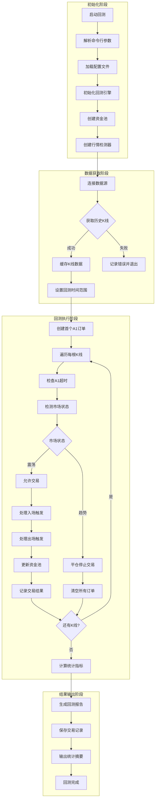
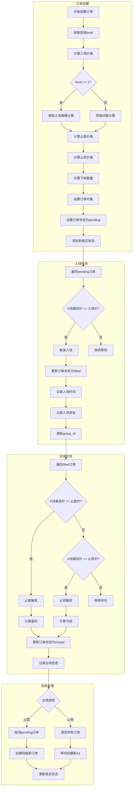
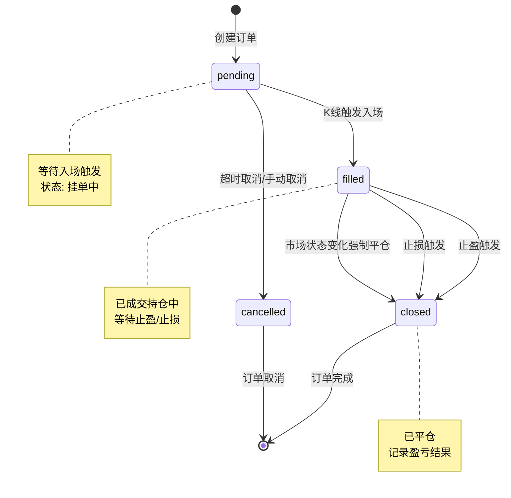
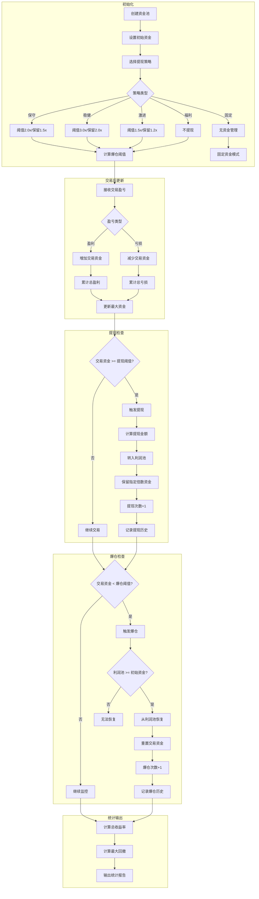
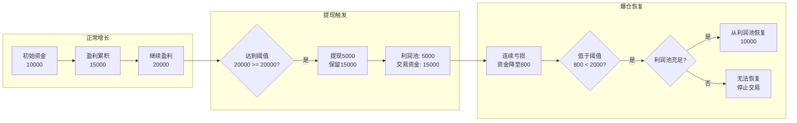
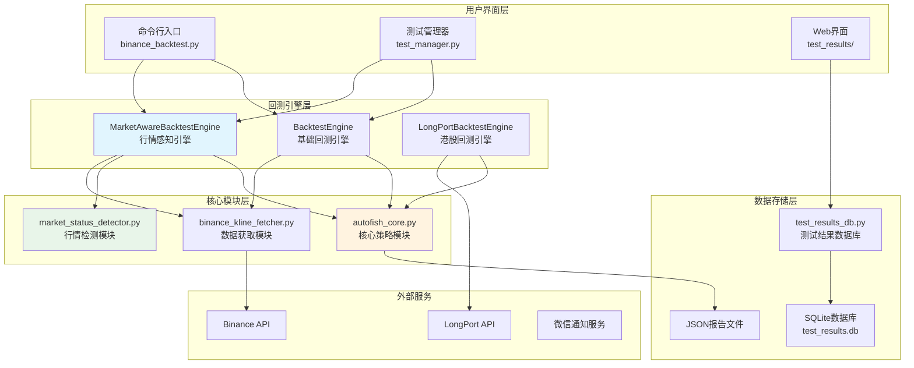
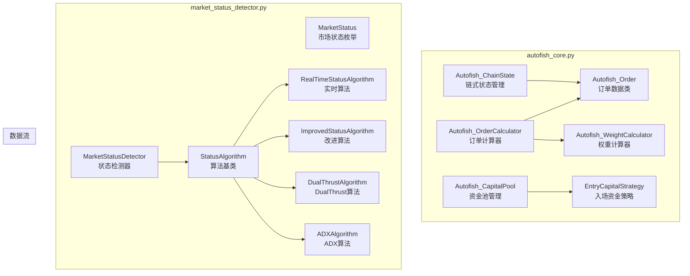
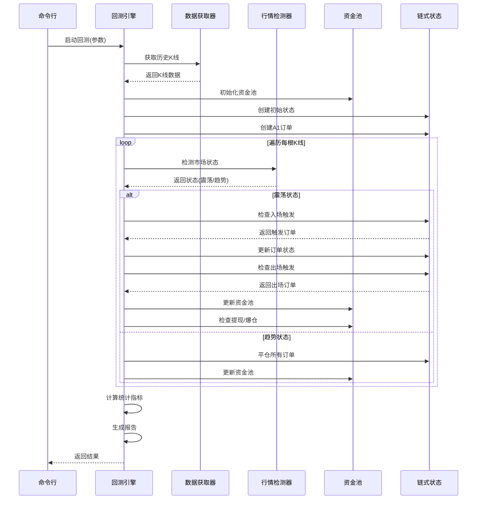
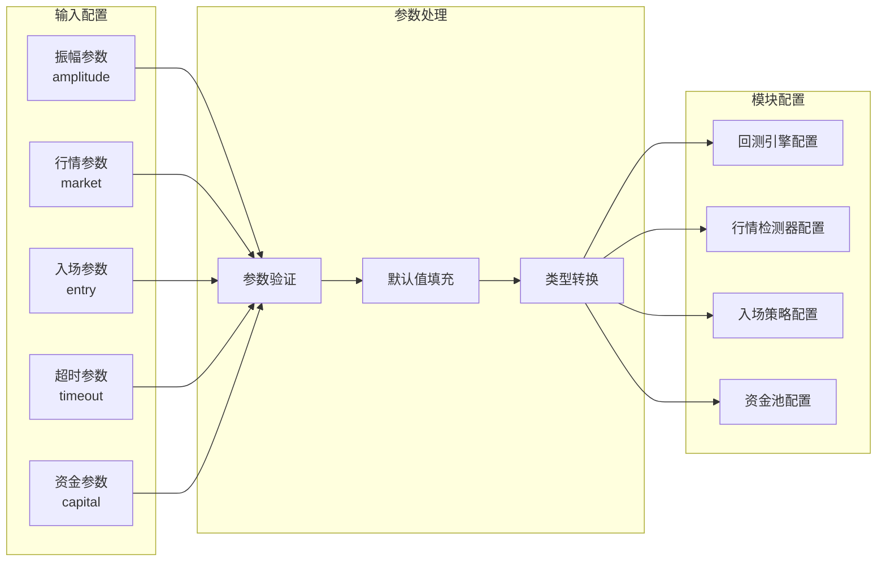

# Autofish Bot V2 系统流程图

本文档包含 Autofish Bot V2 回测系统的核心流程图，涵盖回测主流程、交易执行、资金管理和模块交互。

---

## 1. 回测程序主流程图

展示从数据获取到结果输出的完整流程。



---

## 2. 交易执行流程图

展示订单创建、入场、出场的完整流程。



### 2.1 订单状态机



---

## 3. 资金管理流程图

展示资金池更新、提现、爆仓恢复的流程。



### 3.1 资金池状态流转



---

## 4. 系统模块交互图

展示各模块之间的调用关系。



### 4.1 核心模块内部结构



### 4.2 回测执行时序图



---

## 5. 关键决策点说明

### 5.1 入场决策

| 决策点 | 条件 | 动作 |
|--------|------|------|
| A1入场价计算 | level == 1 | 使用入场策略(ATR/Fixed/Percentage) |
| A2+入场价计算 | level > 1 | 基准价 × (1 - grid_spacing × level) |
| 入场触发 | K线最低价 <= 入场价 | 更新状态为filled，记录入场资金 |

### 5.2 出场决策

| 决策点 | 条件 | 动作 |
|--------|------|------|
| 止盈触发 | K线最高价 >= 止盈价 | 平仓，计算盈利，创建同级新订单 |
| 止损触发 | K线最低价 <= 止损价 | 平仓，计算亏损，清空所有订单 |
| 同时触发 | 止盈和止损同时满足 | 根据K线阴阳线判断顺序 |

### 5.3 资金管理决策

| 决策点 | 条件 | 动作 |
|--------|------|------|
| 提现触发 | 交易资金 >= 初始资金 × 提现阈值 | 转移超出部分到利润池 |
| 爆仓触发 | 交易资金 < 初始资金 × 爆仓阈值 | 尝试从利润池恢复 |
| 恢复成功 | 利润池 >= 初始资金 | 重置交易资金为初始资金 |

### 5.4 市场状态决策

| 决策点 | 条件 | 动作 |
|--------|------|------|
| 震荡转趋势 | 状态从RANGING变为TRENDING | 平仓所有订单，停止交易 |
| 趋势转震荡 | 状态从TRENDING变为RANGING | 创建新A1订单，恢复交易 |
| 保持震荡 | 状态保持RANGING | 正常执行交易逻辑 |

---

## 6. 数据流向标注

```
┌─────────────────────────────────────────────────────────────────┐
│                        数据流向总览                              │
├─────────────────────────────────────────────────────────────────┤
│                                                                 │
│  [外部数据源]                                                    │
│       │                                                         │
│       ▼                                                         │
│  [K线数据] ──────► [行情检测器] ──────► [市场状态]               │
│       │                                    │                    │
│       ▼                                    ▼                    │
│  [回测引擎] ◄──────────────────── [交易控制]                    │
│       │                                                         │
│       ▼                                                         │
│  [链式状态] ──────► [订单管理] ──────► [交易记录]               │
│       │                                    │                    │
│       ▼                                    ▼                    │
│  [资金池] ◄─────────────────────── [盈亏计算]                   │
│       │                                                         │
│       ▼                                                         │
│  [统计报告] ──────► [数据库存储] ──────► [Web展示]              │
│                                                                 │
└─────────────────────────────────────────────────────────────────┘
```

---

## 7. 配置参数流向



---

*文档生成时间: 2026-03-26*
*版本: V2.0*
