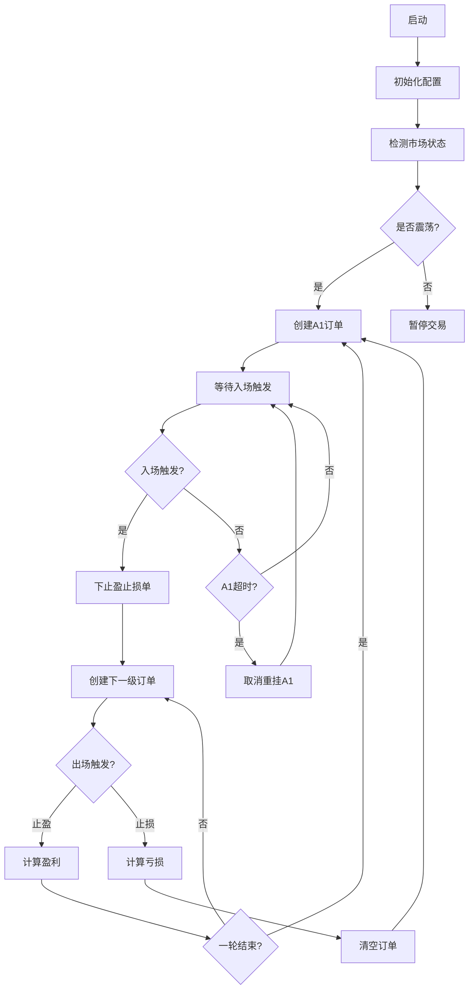

# Autofish Bot V2 交易算法原理文档

## 目录

1. [概述](#1-概述)
2. [市场状态检测算法](#2-市场状态检测算法)
3. [入场条件判断逻辑](#3-入场条件判断逻辑)
4. [出场条件判断逻辑](#4-出场条件判断逻辑)
5. [订单组管理机制](#5-订单组管理机制)
6. [关键配置参数汇总](#6-关键配置参数汇总)

---

## 1. 概述

### 1.1 算法整体设计思路

Autofish Bot V2 是一个基于**链式挂单策略**的量化交易机器人，核心设计理念是：

- **网格交易 + 动态仓位管理**：通过多层级订单分散风险，利用价格波动获取收益
- **行情感知**：根据市场状态（震荡/趋势）动态调整交易策略
- **资金管理**：支持多种资金池策略，实现风险控制和利润锁定

### 1.2 核心策略架构

```
┌─────────────────────────────────────────────────────────────────┐
│                     Autofish V2 策略架构                         │
├─────────────────────────────────────────────────────────────────┤
│                                                                 │
│  ┌──────────────┐    ┌──────────────┐    ┌──────────────┐      │
│  │ 市场状态检测  │───▶│  交易决策    │───▶│  订单执行    │      │
│  │ (震荡/趋势)   │    │ (入场/出场)  │    │ (链式挂单)   │      │
│  └──────────────┘    └──────────────┘    └──────────────┘      │
│         │                   │                   │               │
│         ▼                   ▼                   ▼               │
│  ┌──────────────┐    ┌──────────────┐    ┌──────────────┐      │
│  │ Dual Thrust  │    │ 入场价格策略 │    │ 资金池管理   │      │
│  │ ADX/复合算法 │    │ ATR/布林带等 │    │ 提现/爆仓    │      │
│  └──────────────┘    └──────────────┘    └──────────────┘      │
│                                                                 │
└─────────────────────────────────────────────────────────────────┘
```

### 1.3 交易流程概览



---

## 2. 市场状态检测算法

### 2.1 支持的算法类型

系统支持多种市场状态检测算法，通过配置切换：

| 算法名称 | 类名 | 描述 | 适用场景 |
|---------|------|------|---------|
| `dual_thrust` | DualThrustAlgorithm | Dual Thrust 突破策略 | 日内震荡识别 |
| `adx` | ADXAlgorithm | ADX 趋势强度指标 | 趋势强度判断 |
| `composite` | CompositeAlgorithm | 多指标综合判断 | 复杂市场环境 |
| `improved` | ImprovedStatusAlgorithm | 支撑阻力+箱体震荡 | 中长期判断 |
| `realtime` | RealTimeStatusAlgorithm | 价格行为+波动率 | 实时性要求高 |
| `always_ranging` | AlwaysRangingAlgorithm | 始终返回震荡 | 对比测试 |

### 2.2 Dual Thrust 算法详解

Dual Thrust 是系统默认使用的市场状态检测算法，其核心原理是利用历史波动幅度构建突破区间。

#### 2.2.1 核心公式

```
Range = max(HH - LC, HC - LL)

Upper = Open + K1 × Range
Lower = Open - K2 × Range × K2_Down_Factor
```

其中：
- **HH**: N 天内的最高价
- **LL**: N 天内的最低价
- **HC**: N 天内的最高收盘价
- **LC**: N 天内的最低收盘价
- **Open**: 当日开盘价
- **K1**: 上轨系数（默认 0.4）
- **K2**: 下轨系数（默认 0.4）
- **K2_Down_Factor**: 下跌敏感因子（默认 0.8）

#### 2.2.2 状态判断逻辑

```python
if current_price > upper_band:
    status = TRENDING_UP      # 上涨趋势
elif current_price < lower_band:
    status = TRENDING_DOWN    # 下跌趋势
else:
    status = RANGING          # 震荡行情
```

#### 2.2.3 下跌趋势特殊处理

针对下跌行情的特殊处理机制：

1. **下跌阈值更敏感**：`K2_Down_Factor < 1.0` 使下轨更窄
2. **连续确认**：下跌需要连续 `down_confirm_days` 天确认
3. **冷却期**：状态切换后有 `cooldown_days` 天的冷却期

```python
# 下跌确认逻辑
if is_down_breakthrough and consecutive_down_days >= down_confirm_days:
    new_status = MarketStatus.TRENDING_DOWN
```

#### 2.2.4 代码示例

```python
from market_status_detector import DualThrustAlgorithm, MarketStatusDetector

# 创建算法实例
config = {
    'n_days': 4,
    'k1': 0.4,
    'k2': 0.4,
    'k2_down_factor': 0.8,
    'down_confirm_days': 2,
    'cooldown_days': 1
}

algorithm = DualThrustAlgorithm(config)
detector = MarketStatusDetector(algorithm=algorithm)

# 计算市场状态
result = detector.algorithm.calculate(klines, config)
print(f"状态: {result.status.value}")
print(f"置信度: {result.confidence}")
print(f"原因: {result.reason}")
```

### 2.3 其他算法简介

#### 2.3.1 ADX 算法

基于 ADX（Average Directional Index）趋势强度指标：

```python
# ADX 计算公式
ADX = SMA(DX, period)

# 判断逻辑
if ADX >= threshold:  # 默认 25
    status = TRENDING  # 趋势行情
else:
    status = RANGING   # 震荡行情
```

#### 2.3.2 复合算法（Composite）

综合多指标判断，计算趋势得分：

```python
trend_score = 0

# ADX 贡献 (40分)
if adx >= threshold:
    trend_score += 40

# ATR 贡献 (30分)
if atr_ratio >= atr_multiplier:
    trend_score += 30

# 布林带贡献 (30分)
if bb_width >= bb_width_threshold:
    trend_score += 30

# 判断结果
if trend_score >= 70:
    status = TRENDING
elif trend_score >= 40:
    status = TRANSITIONING
else:
    status = RANGING
```

---

## 3. 入场条件判断逻辑

### 3.1 入场触发条件

入场触发基于 K 线价格与入场价格的比较：

```python
def check_entry_triggered(low_price: Decimal, entry_price: Decimal) -> bool:
    """检查是否触发入场"""
    return low_price <= entry_price
```

**触发条件**：当 K 线最低价 ≤ 入场价格时，订单成交。

### 3.2 入场价格计算策略

系统支持多种入场价格计算策略：

| 策略名称 | 描述 | 公式 |
|---------|------|------|
| `fixed` | 固定网格间距 | `entry = current × (1 - spacing × level)` |
| `atr` | ATR 动态策略 | `spacing = ATR × multiplier / current` |
| `bollinger` | 布林带策略 | `entry = max(下轨, current × (1 - min_spacing))` |
| `support` | 支撑位策略 | `entry = max(支撑位, current × (1 - min_spacing))` |
| `composite` | 综合策略 | `entry = max(ATR价格, 布林带价格, 支撑位价格)` |

#### 3.2.1 ATR 动态策略详解

ATR（Average True Range）动态策略根据市场波动性调整入场价格：

```python
def calculate_entry_price(current_price, level, grid_spacing, klines):
    # 计算 ATR
    atr = calculate_atr(klines, period=14)
    
    # 计算动态间距
    atr_percent = atr / current_price
    dynamic_spacing = atr_percent * atr_multiplier
    
    # 限制间距范围
    dynamic_spacing = max(min_spacing, min(max_spacing, dynamic_spacing))
    
    # 计算入场价格
    entry_price = current_price * (1 - dynamic_spacing * level)
    
    return entry_price
```

**参数说明**：
- `atr_period`: ATR 计算周期，默认 14
- `atr_multiplier`: ATR 乘数，默认 0.5
- `min_spacing`: 最小网格间距，默认 0.5%
- `max_spacing`: 最大网格间距，默认 3%

#### 3.2.2 不同层级的入场价格计算

```python
# A1 订单：使用入场策略计算
if level == 1:
    entry_price = strategy.calculate_entry_price(
        current_price=base_price,
        level=level,
        grid_spacing=grid_spacing,
        klines=klines
    )
# A2/A3/A4 订单：使用固定网格间距
else:
    entry_price = base_price * (1 - grid_spacing * level)
```

### 3.3 A1 超时重挂机制

当 A1 订单长时间未成交时，系统会自动取消并重新挂单。

#### 3.3.1 超时检查逻辑

```python
def check_first_entry_timeout(current_time, timeout_minutes):
    """检查 A1 订单是否超时"""
    if timeout_minutes <= 0:
        return None
    
    first_entry = get_pending_first_entry()
    if not first_entry or not first_entry.created_at:
        return None
    
    created = datetime.strptime(first_entry.created_at, '%Y-%m-%d %H:%M:%S')
    elapsed = (current_time - created).total_seconds() / 60
    
    if elapsed >= timeout_minutes:
        return first_entry
    
    return None
```

#### 3.3.2 重挂流程

```python
async def handle_a1_timeout(timeout_order, current_price, current_time):
    """处理 A1 超时重挂"""
    # 1. 取消原订单
    chain_state.orders.remove(timeout_order)
    
    # 2. 创建新订单
    new_order = create_order(1, current_price, klines)
    chain_state.orders.append(new_order)
    
    # 3. 更新基准价格
    chain_state.base_price = current_price
    
    # 4. 记录日志
    logger.info(f"[A1 超时] 原入场价={timeout_order.entry_price}, "
                f"新入场价={new_order.entry_price}")
```

---

## 4. 出场条件判断逻辑

### 4.1 止盈判断

止盈触发条件：K 线最高价 ≥ 止盈价格

```python
def check_take_profit_triggered(high_price: Decimal, take_profit_price: Decimal) -> bool:
    """检查是否触发止盈"""
    return high_price >= take_profit_price
```

**止盈价格计算**：

```python
take_profit_price = entry_price * (1 + exit_profit)
```

其中 `exit_profit` 默认为 1%。

### 4.2 止损判断

止损触发条件：K 线最低价 ≤ 止损价格

```python
def check_stop_loss_triggered(low_price: Decimal, stop_loss_price: Decimal) -> bool:
    """检查是否触发止损"""
    return low_price <= stop_loss_price
```

**止损价格计算**：

```python
stop_loss_price = entry_price * (1 - stop_loss)
```

其中 `stop_loss` 默认为 8%。

### 4.3 出场处理流程

#### 4.3.1 同时触发处理

当止盈和止损同时满足时，根据 K 线阴阳判断触发顺序：

```python
if current_price >= open_price:
    # 阳线 - 假设先跌后涨，止损先触发
    for order in sl_orders:
        close_order(order, "stop_loss", stop_loss_price)
    for order in tp_orders:
        if order.level not in closed_levels:
            close_order(order, "take_profit", take_profit_price)
else:
    # 阴线 - 假设先涨后跌，止盈先触发
    for order in tp_orders:
        close_order(order, "take_profit", take_profit_price)
    for order in sl_orders:
        if order.level not in closed_levels:
            close_order(order, "stop_loss", stop_loss_price)
```

#### 4.3.2 盈亏计算

```python
def calculate_profit(order, close_price, leverage):
    """计算盈亏"""
    price_diff = close_price - order.entry_price
    profit = price_diff * order.quantity * leverage
    return profit
```

**示例**：
- 入场价格：50000 USDT
- 出场价格：50500 USDT（止盈）
- 数量：0.01 BTC
- 杠杆：10x
- 盈利 = (50500 - 50000) × 0.01 × 10 = 50 USDT

#### 4.3.3 出场后订单重建

```python
def process_exit_aftermath(closed_levels, current_price, trading_enabled):
    """出场后处理"""
    # 取消所有挂单
    chain_state.cancel_pending_orders()
    
    # 检查行情状态
    if not trading_enabled:
        return
    
    # 检查是否一轮结束
    if chain_state.is_order_chain_finished():
        # 一轮结束，创建新 A1
        new_order = create_order(1, current_price, klines)
    else:
        # 还有订单在场内，重建同级订单
        for level in closed_levels:
            new_order = create_order(level, current_price)
```

---

## 5. 订单组管理机制

### 5.1 订单数据结构

```python
@dataclass
class Autofish_Order:
    """订单数据类"""
    level: int                              # 订单层级 (1, 2, 3, 4, ...)
    entry_price: Decimal                    # 入场价格
    quantity: Decimal                       # 数量 (BTC)
    stake_amount: Decimal                   # 投入金额 (USDT)
    take_profit_price: Decimal              # 止盈价格
    stop_loss_price: Decimal                # 止损价格
    state: str = "pending"                  # 订单状态
    order_id: Optional[int] = None          # 入场单 ID
    tp_order_id: Optional[int] = None       # 止盈单 ID
    sl_order_id: Optional[int] = None       # 止损单 ID
    close_price: Optional[Decimal] = None   # 平仓价格
    close_reason: Optional[str] = None      # 平仓原因
    profit: Optional[Decimal] = None        # 盈亏金额
    created_at: Optional[str] = None        # 创建时间
    filled_at: Optional[str] = None         # 成交时间
    closed_at: Optional[str] = None         # 平仓时间
    entry_capital: Optional[Decimal] = None # 入场资金
    entry_total_capital: Optional[Decimal] = None  # 入场总资金
    group_id: int = 0                       # 轮次 ID
```

### 5.2 链式挂单状态管理

```python
@dataclass
class Autofish_ChainState:
    """链式挂单状态"""
    base_price: Decimal                     # 基准价格
    orders: List[Autofish_Order]            # 订单列表
    is_active: bool = True                  # 是否活跃
    round_entry_capital: Decimal = None     # 轮次入场资金
    round_entry_total_capital: Decimal = None  # 轮次入场总资金
    group_id: int = 0                       # 当前轮次 ID
```

**订单状态流转**：

```
pending（挂单中）→ filled（已成交）→ closed（已平仓）
       ↓
   cancelled（已取消）
```

### 5.3 Group ID 管理机制

Group ID 用于标识一轮完整的交易周期：

```python
# A1 订单创建时
if level == 1:
    actual_group_id = chain_state.group_id + 1

# A1 成交时
if pending_order.level == 1:
    chain_state.group_id = pending_order.group_id

# A2/A3/A4 订单创建时
else:
    actual_group_id = chain_state.group_id
```

**Group ID 规则**：
1. 每轮交易从 A1 成交开始，group_id 递增
2. 同一轮内的所有订单共享相同的 group_id
3. 止损后新一轮交易 group_id 继续递增

### 5.4 权重分配机制

#### 5.4.1 权重计算公式

```python
def calculate_weights(amplitude_probabilities, decay_factor):
    """计算各层级权重"""
    beta = 1 / decay_factor
    raw_weights = []
    
    for amp, prob in amplitude_probabilities.items():
        raw_weight = amp * (prob ** beta)
        raw_weights.append(raw_weight)
    
    # 归一化
    total = sum(raw_weights)
    return [w / total for w in raw_weights]
```

#### 5.4.2 默认权重分布

| 层级 | 权重 (d=0.5) | 权重 (d=1.0) |
|-----|-------------|-------------|
| A1 | 36% | 25% |
| A2 | 24% | 25% |
| A3 | 16% | 25% |
| A4 | 9% | 25% |

#### 5.4.3 资金分配示例

```python
# 总资金: 10000 USDT
# 权重: [0.36, 0.24, 0.16, 0.09]

# A1 资金
stake_a1 = 10000 * 0.36 = 3600 USDT

# A2 资金
stake_a2 = 10000 * 0.24 = 2400 USDT

# A3 资金
stake_a3 = 10000 * 0.16 = 1600 USDT

# A4 资金
stake_a4 = 10000 * 0.09 = 900 USDT
```

---

## 6. 关键配置参数汇总

### 6.1 振幅参数 (Amplitude)

| 参数名 | 类型 | 默认值 | 说明 |
|-------|------|-------|------|
| `symbol` | str | BTCUSDT | 交易对 |
| `leverage` | int | 10 | 杠杆倍数 |
| `grid_spacing` | Decimal | 0.01 | 网格间距 (1%) |
| `exit_profit` | Decimal | 0.01 | 止盈比例 (1%) |
| `stop_loss` | Decimal | 0.08 | 止损比例 (8%) |
| `total_amount_quote` | Decimal | 10000 | 总资金 (USDT) |
| `max_entries` | int | 4 | 最大层级数 |
| `decay_factor` | Decimal | 0.5 | 衰减因子 |
| `weights` | List | [0.36, 0.24, 0.16, 0.09] | 权重列表 |

### 6.2 行情参数 (Market)

| 参数名 | 类型 | 默认值 | 说明 |
|-------|------|-------|------|
| `algorithm` | str | dual_thrust | 行情判断算法 |
| `trading_statuses` | List | [ranging] | 允许交易的市场状态 |
| `interval` | str | 1d | 行情判断周期 |
| `min_market_klines` | int | 20 | 最小 K 线数量 |

#### Dual Thrust 算法参数

| 参数名 | 类型 | 默认值 | 说明 |
|-------|------|-------|------|
| `n_days` | int | 4 | 回溯天数 |
| `k1` | float | 0.4 | 上轨系数 |
| `k2` | float | 0.4 | 下轨系数 |
| `k2_down_factor` | float | 0.8 | 下跌敏感因子 |
| `down_confirm_days` | int | 2 | 下跌确认天数 |
| `cooldown_days` | int | 1 | 冷却天数 |

### 6.3 入场参数 (Entry)

| 参数名 | 类型 | 默认值 | 说明 |
|-------|------|-------|------|
| `strategy` | str | atr | 入场价格策略 |

#### ATR 策略参数

| 参数名 | 类型 | 默认值 | 说明 |
|-------|------|-------|------|
| `atr_period` | int | 14 | ATR 周期 |
| `atr_multiplier` | float | 0.5 | ATR 乘数 |
| `min_spacing` | float | 0.005 | 最小间距 (0.5%) |
| `max_spacing` | float | 0.03 | 最大间距 (3%) |

### 6.4 超时参数 (Timeout)

| 参数名 | 类型 | 默认值 | 说明 |
|-------|------|-------|------|
| `a1_timeout_minutes` | int | 10 | A1 超时时间（分钟），0 表示禁用 |

### 6.5 资金参数 (Capital)

| 参数名 | 类型 | 默认值 | 说明 |
|-------|------|-------|------|
| `strategy` | str | guding | 资金池策略 |
| `entry_mode` | str | compound | 入场资金计算模式 |

#### 资金池策略

| 策略名 | 说明 | 提现阈值 | 保留倍数 |
|-------|------|---------|---------|
| `guding` | 固定模式 | - | - |
| `baoshou` | 保守策略 | 2.0x | 1.5x |
| `wenjian` | 稳健策略 | 3.0x | 2.0x |
| `jijin` | 激进策略 | 1.5x | 1.2x |
| `fuli` | 复利策略 | 不提现 | - |

### 6.6 配置示例

```json
{
  "amplitude": {
    "symbol": "BTCUSDT",
    "leverage": 10,
    "grid_spacing": 0.01,
    "exit_profit": 0.01,
    "stop_loss": 0.08,
    "total_amount_quote": 10000,
    "max_entries": 4,
    "decay_factor": 0.5,
    "weights": [0.36, 0.24, 0.16, 0.09]
  },
  "market": {
    "algorithm": "dual_thrust",
    "trading_statuses": ["ranging"],
    "dual_thrust": {
      "n_days": 4,
      "k1": 0.4,
      "k2": 0.4,
      "k2_down_factor": 0.8,
      "down_confirm_days": 2,
      "cooldown_days": 1
    }
  },
  "entry": {
    "strategy": "atr",
    "atr": {
      "atr_period": 14,
      "atr_multiplier": 0.5,
      "min_spacing": 0.005,
      "max_spacing": 0.03
    }
  },
  "timeout": {
    "a1_timeout_minutes": 10
  },
  "capital": {
    "strategy": "baoshou",
    "entry_mode": "compound",
    "baoshou": {
      "withdrawal_threshold": 2.0,
      "withdrawal_retain": 1.5
    }
  }
}
```

---

## 附录

### A. 公式汇总

| 名称 | 公式 |
|-----|------|
| 入场价格（固定） | `entry = current × (1 - spacing × level)` |
| 止盈价格 | `tp = entry × (1 + exit_profit)` |
| 止损价格 | `sl = entry × (1 - stop_loss)` |
| 盈亏计算 | `profit = (close - entry) × qty × leverage` |
| Dual Thrust Range | `Range = max(HH - LC, HC - LL)` |
| Dual Thrust 上轨 | `Upper = Open + K1 × Range` |
| Dual Thrust 下轨 | `Lower = Open - K2 × Range × K2_Down_Factor` |
| ATR | `ATR = SMA(TR, period)` |
| 权重计算 | `weight = amp × prob^(1/d)` |

### B. 状态枚举

```python
class MarketStatus(Enum):
    RANGING = "ranging"              # 震荡行情
    TRENDING_UP = "trending_up"      # 上涨趋势
    TRENDING_DOWN = "trending_down"  # 下跌趋势
    TRANSITIONING = "transitioning"  # 过渡状态
    UNKNOWN = "unknown"              # 未知状态

class OrderState(Enum):
    PENDING = "pending"    # 挂单中
    FILLED = "filled"      # 已成交
    CLOSED = "closed"      # 已平仓
    CANCELLED = "cancelled" # 已取消
```

---

*文档版本: V2.0*  
*生成时间: 2026-03-26*
